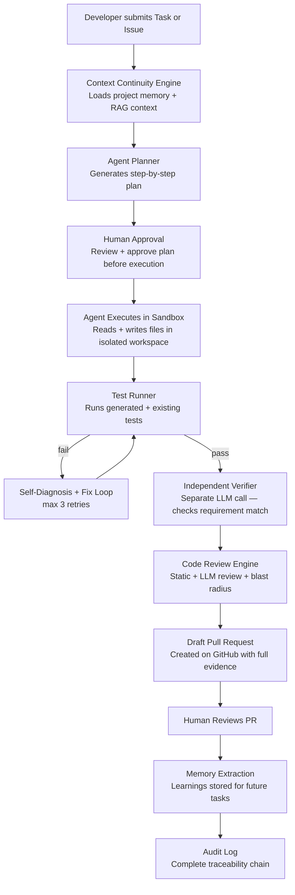

# 01. Project Overview
> **Version:** 1.0 | **Created:** 2026-09-24 | **Last Updated:** 2026-09-24 | **Owner:** Team | **Status:** Approved

---

## Problem Statement

Modern software teams juggle code review, testing, debugging, issue tracking, and pull request management across disconnected tools. Each activity happens in isolation — no shared thread connects *why* the work exists, *what was already tried*, and *what happened last time*.

This fragmentation worsens with AI involvement. Existing AI coding assistants are **stateless**: every session starts from zero. They don't know the project's architecture, the decisions that shaped it, the rules the team follows, or the approaches that already failed. Developers re-explain context repeatedly, and AI-generated changes often ignore conventions or repeat mistakes because nothing is remembered.

Additionally, giving an autonomous agent free rein over a codebase is unsafe. Without permissions, sandboxing, and human checkpoints, agentic execution risks unreviewed changes reaching production, runaway loops, or actions no one can trace back to a reason.

**Core problem:** software engineering work is fragmented, AI assistance is forgetful, and autonomous agents lack guardrails for developer trust.

---

## Objective

Build an AI-powered **Agentic Software Engineering Platform** that integrates with GitHub to:
1. Understand a project's codebase structurally (AST + dependency graph)
2. Remember engineering context across sessions (project memory)
3. Analyze changes for correctness, security, and impact
4. Execute development tasks safely inside sandboxes
5. Validate results independently before human review
6. Prepare draft pull requests with full traceability evidence

---

## System Flow

---

## Scope

### Included (Current Scope — Weeks 1–3)

| Area | What's In Scope |
|---|---|
| GitHub Integration | OAuth login, repository listing, cloning, webhook events, draft PR creation |
| Repository Engine | File walking, language detection, AST parsing (tree-sitter), symbol extraction, dependency graph |
| AI/ML Pipeline | LLM gateway, embeddings, vector search (pgvector), lexical search, RRF fusion, reranking, RAG |
| AI Analysis | Code review, bug detection, security analysis, blast radius, code explanation |
| Memory System | Project memory, decision memory, task memory, failure memory, context checkpoints |
| Agentic System | Task planning, sandbox execution, test generation+run, self-verification, draft PR |
| Testing | Test generation, test execution, CI failure diagnosis |
| Safety | Permission engine, budget limits, human approval gates, kill switch, rollback |
| Frontend | Dashboard, repository list, repository detail, repository-aware chat |
| Infrastructure | PostgreSQL 15 + pgvector, Redis, Docker Compose |

### Excluded (Future Scope — Post Week 3)

| Excluded | Reason |
|---|---|
| Multi-agent parallelism | Cross-agent handoff is P2 — deferred |
| Agent task queue | P2 — deferred |
| Agent analytics dashboard | P2 — deferred |
| Memory dashboard UI | P1 — Week 3 or shortly after |
| Full billing/metering | Out of scope for project |
| Self-hosted LLM | Current provider: OpenAI only |
| Support for non-GitHub VCS | GitHub only for now |

---

## Target Users

| User Type | Description |
|---|---|
| **Developer** | Primary user: submits tasks, reviews agent output, approves plans, merges PRs |
| **Team Lead** | Reviews agent analytics, manages project rules, oversees memory |
| **Platform Admin** | TBD — manages installations, billing (future scope) |

> **Note:** No separate "Admin" role has been implemented in the current codebase. Role distinction is TBD.

---

## Core Features

### F-01: GitHub Integration
| Field | Value |
|---|---|
| **Purpose** | Connect the platform to GitHub for auth, repos, webhooks, PRs |
| **User** | Developer |
| **Priority** | P0 |
| **Status** | 🔵 In Progress |
| **Dependencies** | GitHub App credentials in `.env` |
| **Related APIs** | `GET /api/v1/auth/github/login`, `GET /api/v1/auth/github/callback` |
| **Related DB Tables** | `users`, `github_installations`, `repositories` (planned) |

### F-02: Repository Engine (Scanner)
| Field | Value |
|---|---|
| **Purpose** | Structural code understanding — file tree, AST, symbols, dependency graph |
| **User** | System (background) |
| **Priority** | P0 |
| **Status** | 🔵 In Progress (Walker done; Parser/Graph TBD) |
| **Dependencies** | tree-sitter, `repository_files` DB table |
| **Related Modules** | `backend/scanner/` |

### F-03: Code Indexing
| Field | Value |
|---|---|
| **Purpose** | Convert parsed symbols into vector-indexed chunks for RAG |
| **User** | System (background) |
| **Priority** | P0 |
| **Status** | 🟢 Chunker done; embedding queue TBD |
| **Dependencies** | `code_chunks` DB table (Om), EmbeddingService |
| **Related Modules** | `backend/indexer/` |

### F-04: RAG Pipeline (Repository-Aware Chat)
| Field | Value |
|---|---|
| **Purpose** | Answer developer questions about their codebase with grounded sources |
| **User** | Developer |
| **Priority** | P1 |
| **Status** | 🔵 In Progress (Vector done; Lexical/Fusion/Rerank stubs) |
| **Dependencies** | `code_chunks` DB table, EmbeddingService, LLMGateway |
| **Related Modules** | `backend/ai/retrieval/`, `backend/ai/context/`, `backend/ai/llm/` |

### F-05: LLM Gateway
| Field | Value |
|---|---|
| **Purpose** | Single, centralized, logged, retry-capable LLM call entry point |
| **User** | System (all AI features) |
| **Priority** | P0 |
| **Status** | 🟢 Done |
| **Related Modules** | `backend/ai/llm/client.py`, `backend/ai/llm/openai_provider.py` |

### F-06: Agentic System
| Field | Value |
|---|---|
| **Purpose** | Autonomous task execution: plan → execute → test → verify → PR |
| **User** | Developer |
| **Priority** | P0 |
| **Status** | ⚪ Todo (Week 2) |
| **Dependencies** | All W1 components, sandbox, policy engine |

### F-07: Context Continuity Engine (Memory)
| Field | Value |
|---|---|
| **Purpose** | Persist project knowledge across sessions |
| **User** | System (agent) |
| **Priority** | P0 |
| **Status** | ⚪ Todo (Week 2) |
| **Dependencies** | PostgreSQL, Redis, LLM Gateway |

### F-08: Agent Safety System
| Field | Value |
|---|---|
| **Purpose** | Permission engine, budget limits, human approval gates |
| **User** | Developer |
| **Priority** | P0 |
| **Status** | ⚪ Todo (skeleton exists in `backend/agent/policy/`) |

---

## Technology Stack

| Layer | Technology |
|---|---|
| **Backend Framework** | FastAPI 0.115 |
| **Language (Backend)** | Python 3.11+ |
| **ORM** | SQLAlchemy 2.0 |
| **Migrations** | Alembic 1.13 |
| **Primary DB** | PostgreSQL 15 with pgvector extension |
| **Cache / Queue** | Redis 7 |
| **LLM Provider** | OpenAI (Chat Completions + Embeddings) |
| **Embedding Model** | `text-embedding-3-small` (TBD via config) |
| **Reranker Model** | `cross-encoder/ms-marco-MiniLM-L-6-v2` |
| **AST Parser** | tree-sitter |
| **Frontend Framework** | Vite + React 19 + TypeScript |
| **Frontend State** | Zustand 5 |
| **Server State** | TanStack Query 5 |
| **HTTP Client (FE)** | Axios |
| **Auth** | GitHub OAuth + JWT (HS256) |
| **Containerization** | Docker Compose |
| **Testing** | pytest, pytest-asyncio, httpx |

---

## Key Differentiators

| Differentiator | Implementation |
|---|---|
| **It remembers** | Context Continuity Engine — project memory persisted in PostgreSQL |
| **It acts, not just advises** | Agent executes in sandbox, generates PRs |
| **It stays safe** | Permission tiers, budget limits, mandatory human checkpoints |
| **It stays traceable** | Requirement → task → files → tests → PR → memory chain |
