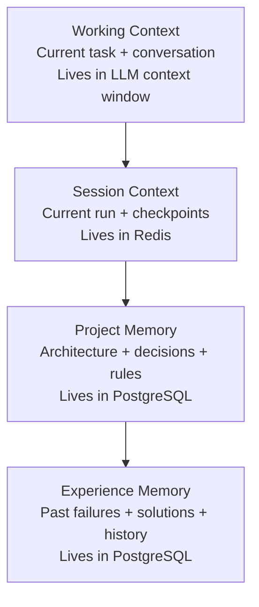

# 03. Features Overview
> **Version:** 1.0 | **Created:** 2026-09-24 | **Last Updated:** 2026-09-24

---

## Complete Feature List

### Priority Legend
| Symbol | Priority | Meaning | Target |
|---|---|---|---|
| P0 | Critical | Platform does not work without it | Week 1–3 |
| P1 | Strong | Significantly improves experience | Week 3 or shortly after |
| P2 | Future | Valuable but not critical | Post-launch |

---

## 1. GitHub & Repository Features

| ID | Feature | Priority | Status | Owner |
|---|---|---|---|---|
| F-01 | GitHub Integration (OAuth, App install, webhook) | P0 | 🔵 In Progress | Parth / Yug |
| F-02 | Repository Engine (walk, detect, parse, symbols, dep graph) | P0 | 🔵 In Progress | Prit |
| F-03 | Repository Sync (clone → scan → index pipeline) | P0 | ⚪ Todo | Parth / Prit / Divu |

---

## 2. AI Analysis Features

| ID | Feature | Priority | Status | Owner |
|---|---|---|---|---|
| F-04 | Repository-Aware AI Chat (RAG pipeline) | P1 | 🔵 In Progress | Meet / Dev |
| F-05 | LLM Gateway | P0 | 🟢 Done | Meet |
| F-06 | Code Embedding Service | P0 | 🟢 Done | Meet |
| F-07 | Hybrid Retrieval (Vector + Lexical + RRF + Rerank) | P0 | 🔵 In Progress | Meet |
| F-08 | Context Builder | P0 | 🔵 In Progress | Meet |
| F-09 | Prompt Builder | P0 | 🟢 Done | Dev |
| F-10 | Output Validator + Repair | P0 | 🟢 Done | Dev |
| F-11 | Grounding Validator | P0 | 🟢 Skeleton | Dev |
| F-12 | AI Code Review | P0 | ⚪ Todo | Dev |
| F-13 | Bug Detection | P0 | ⚪ Todo | Dev |
| F-14 | Security Analysis | P0 | ⚪ Todo | Dev |
| F-15 | Blast Radius / Change Impact Analysis | P0 | ⚪ Todo | Divu |
| F-16 | Code Explanation | P0 | ⚪ Todo | Dev |
| F-17 | Agent Quality Score | P1 | ⚪ Todo | Dev |

---

## 3. Testing & Quality Features

| ID | Feature | Priority | Status | Owner |
|---|---|---|---|---|
| F-18 | Test Generation | P0 | ⚪ Todo | Dev / Agent |
| F-19 | Test Execution + Result Analysis | P0 | ⚪ Todo | Divu |
| F-20 | CI Failure Diagnosis | P0 | ⚪ Todo | Dev |
| F-21 | Independent Verification | P0 | ⚪ Todo | Dev |
| F-22 | Project Standards Engine | P0 | ⚪ Todo | Sukun |

---

## 4. Issues & Pull Requests Features

| ID | Feature | Priority | Status | Owner |
|---|---|---|---|---|
| F-23 | Issue Creation from AI Finding | P0 | ⚪ Todo | Parth |
| F-24 | Issue → Automatic Draft PR Agent | P0 | ⚪ Todo | Meet |

---

## 5. Agentic Development Features

| ID | Feature | Priority | Status | Owner |
|---|---|---|---|---|
| F-25 | Agentic Software Engineering System | P0 | ⚪ Todo | Meet |
| F-26 | Natural-Language Development Tasks | P0 | ⚪ Todo | Meet / Dev |
| F-27 | Agent Task Planner | P0 | ⚪ Todo | Meet / Dev |
| F-28 | Agent Execution Sandbox | P0 | ⚪ Todo | Prit |
| F-29 | Agent Permission / Policy Engine | P0 | ⚪ Todo (skeleton) | Sukun |
| F-30 | Agent Self-Verification Loop | P0 | ⚪ Todo | Meet |
| F-31 | Agent Task Queue | P2 | ⚪ Todo | Yug |
| F-32 | Cross-Agent Handoff | P2 | ⚪ Todo | Meet |

---

## 6. Context Continuity / Memory Features

| ID | Feature | Priority | Status | Owner |
|---|---|---|---|---|
| F-33 | Context Continuity Engine | P0 | ⚪ Todo | Meet / Om |
| F-34 | Project Memory | P0 | ⚪ Todo | Om / Meet |
| F-35 | Decision Memory | P0 | ⚪ Todo | Om / Meet |
| F-36 | Task Memory | P0 | ⚪ Todo | Om / Meet |
| F-37 | Agent Work Memory | P0 | ⚪ Todo | Om / Meet |
| F-38 | Failure Memory | P1 | ⚪ Todo | Om / Meet |
| F-39 | Project Rules Engine | P0 | ⚪ Todo | Sukun |
| F-40 | Context Checkpoints (Redis) | P0 | ⚪ Todo | Meet |
| F-41 | Context Retrieval (Memory RAG) | P0 | ⚪ Todo | Meet |
| F-42 | Context Conflict Detection | P1 | ⚪ Todo | Meet |
| F-43 | Memory Versioning | P1 | ⚪ Todo | Om |
| F-44 | Sensitive Context Protection (Secret Redaction) | P0 | ⚪ Todo | Sukun |
| F-45 | Memory Dashboard | P1 | ⚪ Todo | Dhramraj |

---

## 7. Agent Safety Features

| ID | Feature | Priority | Status | Owner |
|---|---|---|---|---|
| F-46 | Agent Rollback & Recovery | P0 | ⚪ Todo | Meet |
| F-47 | Agent Kill Switch | P0 | ⚪ Todo | Meet / Yug |
| F-48 | Agent Budget & Resource Limits | P0 | ⚪ Todo | Meet |
| F-49 | Human Approval Checkpoints | P0 | ⚪ Todo | Yug |

---

## 8. Traceability Features

| ID | Feature | Priority | Status | Owner |
|---|---|---|---|---|
| F-50 | Requirements → Code → Test → PR Traceability | P0 | ⚪ Todo | Yug |
| F-51 | Agent Decision / Evidence Trace | P1 | ⚪ Todo | Meet |

---

## 9. Dashboard & Observability Features

| ID | Feature | Priority | Status | Owner |
|---|---|---|---|---|
| F-52 | Agent Activity Timeline | P0 | ⚪ Todo | Dhramraj |
| F-53 | Agent Analytics | P2 | ⚪ Todo | Dhramraj |
| F-54 | Developer Dashboard | P0 | 🔵 In Progress | Dhramraj |

---

## Four Memory Levels (Context Continuity Engine)

---

## Agent Budget Limits

| Limit | Default |
|---|---|
| Total iterations | 40 |
| Tool calls per step | 15 |
| Test retries per failure | 3 |
| Wall-clock time | 30 minutes |
| LLM token budget | 500k tokens |
| Sandbox CPU time | 60 minutes cumulative |

On any limit hit: agent saves checkpoint → PAUSED → notifies developer.
