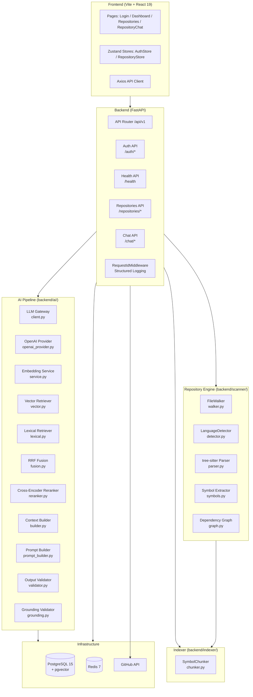
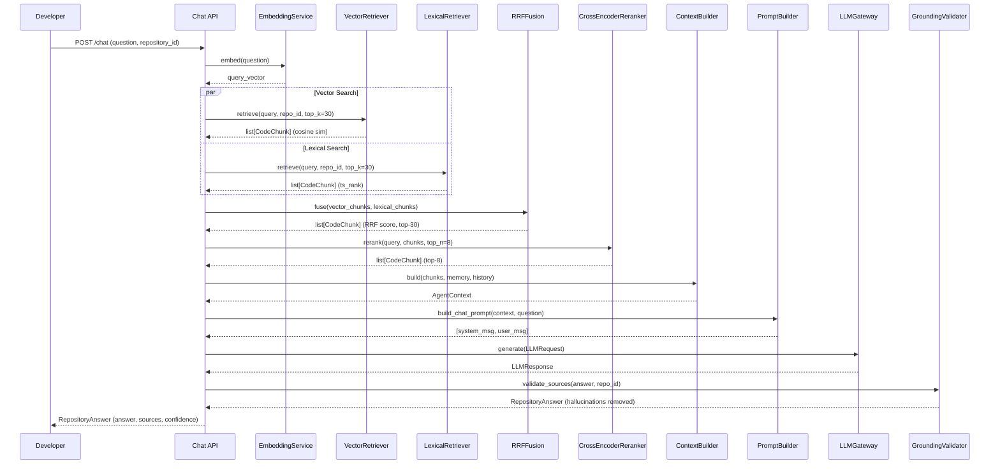
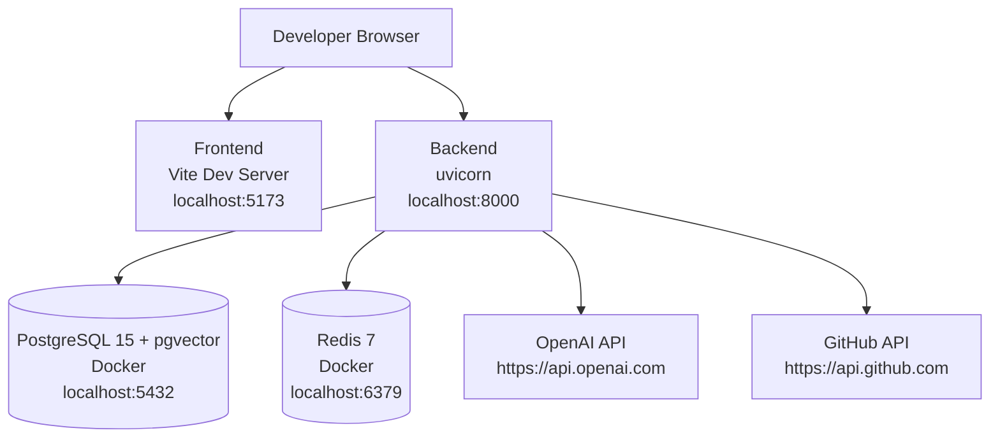

# 05. System Architecture
> **Version:** 1.0 | **Created:** 2026-09-24 | **Last Updated:** 2026-09-24 | **Status:** Draft

---

## High-Level Architecture

---

## Backend Module Ownership

| Module | Path | Owner | Status |
|---|---|---|---|
| API Router | `backend/app/api/v1/` | Yug | 🟢 Skeleton done |
| Core Config | `backend/app/core/config.py` | Yug | 🟢 Done |
| Core Database | `backend/app/core/database.py` | Yug | 🟢 Done |
| Core Logging | `backend/app/core/logging.py` | Yug | 🟢 Done |
| App Models | `backend/app/models/` | Om | ⚪ Todo |
| App Repositories | `backend/app/repositories/` | Om | ⚪ Todo |
| App Schemas | `backend/app/schemas/` | Yug + Dev | 🟢 Partial |
| App Services | `backend/app/services/` | Module owners | ⚪ Todo |
| GitHub Integration | `backend/app/integrations/github/` | Parth | ⚪ Todo |
| Workers | `backend/app/workers/` | Yug | ⚪ Todo |
| LLM Gateway | `backend/ai/llm/` | Meet | 🟢 Done |
| Embedding Service | `backend/ai/embeddings/` | Meet | 🟢 Done |
| Vector Retriever | `backend/ai/retrieval/vector.py` | Meet | 🟢 Done |
| Lexical Retriever | `backend/ai/retrieval/lexical.py` | Meet | 🔵 Stub |
| RRF Fusion | `backend/ai/retrieval/fusion.py` | Meet | 🔵 Stub |
| Cross-Encoder Reranker | `backend/ai/retrieval/reranker.py` | Meet | 🔵 Stub |
| Context Builder | `backend/ai/context/builder.py` | Meet | 🔵 Stub |
| Prompt Builder | `backend/ai/schemas/prompt_builder.py` | Dev | 🟢 Done |
| Output Validator | `backend/ai/schemas/validator.py` | Dev | 🟢 Done |
| Grounding Validator | `backend/ai/schemas/grounding.py` | Dev | 🟢 Skeleton |
| Output Schemas | `backend/ai/schemas/output.py` | Dev | 🟢 Done |
| Prompts | `backend/ai/prompts/` | Dev | 🟢 Files exist |
| Scanner | `backend/scanner/` | Prit | 🔵 Walker done |
| Indexer | `backend/indexer/` | Divu | 🟢 Chunker done |
| Agent (future) | `backend/agent/` | Multiple | ⚪ Todo |
| Tests | `backend/tests/` | Keval | 🔵 In Progress |

---

## Component Data Flow: RAG Pipeline

---

## Deployment Architecture (Current)

**Current environment:** Local development only.

**Docker Compose services:**
- `postgres`: `pgvector/pgvector:pg15`, port 5432, volume `postgres_data`
- `redis`: `redis:7-alpine`, port 6379, volume `redis_data`

**Backend startup:** `uvicorn app.main:app --reload` from `backend/`

**Config source:** `pydantic-settings` reads from `.env` file at project root.

---

## Key Architectural Rules

1. **LLM Gateway is the ONLY entry point** for LLM calls. No module imports the LLM SDK directly. Source: `team_rules.md`
2. **Repository content is DATA, never SYSTEM instructions.** Prompt injection prevention. Source: `prompt_architecture.md`
3. **Repository queries must filter by `repository_id`.** No cross-repository data leakage. Source: `vector.py` comment.
4. **Raw SQL only inside Om's repository layer** (exception: `VectorRetriever` uses `text()` for pgvector's `<=>` operator).
5. **Every migration must be reversible.** Source: `team_rules.md`
6. **Agents can only read production; writes happen in sandboxes.** Source: `project_idea.md`
7. **Nothing reaches GitHub without two human approvals** (plan approval + push approval). Source: `project_idea.md`
