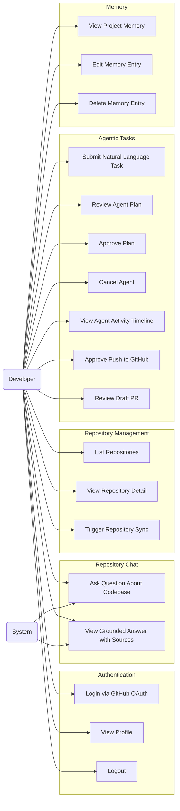
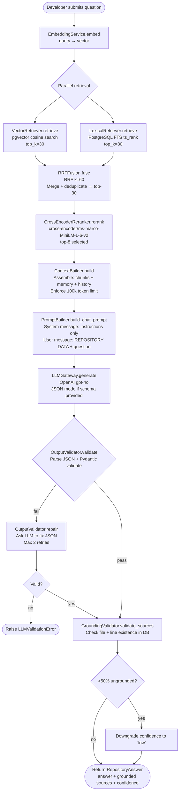
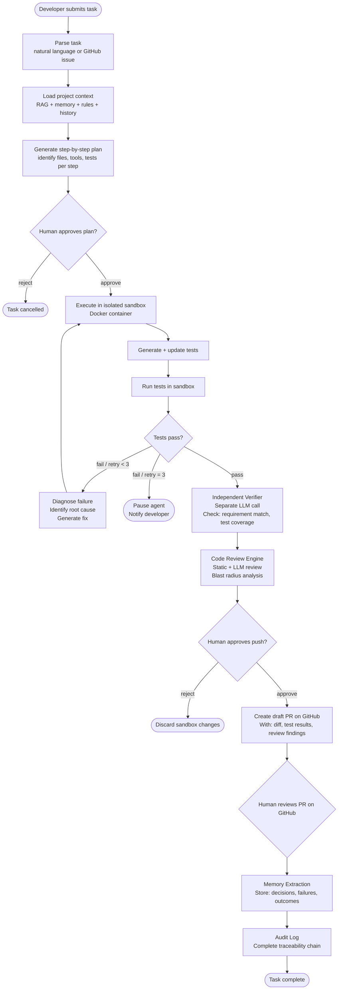
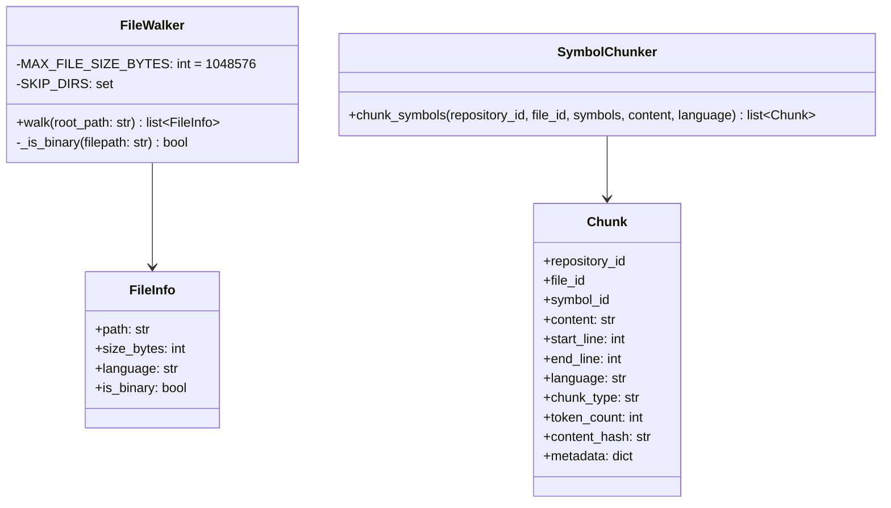
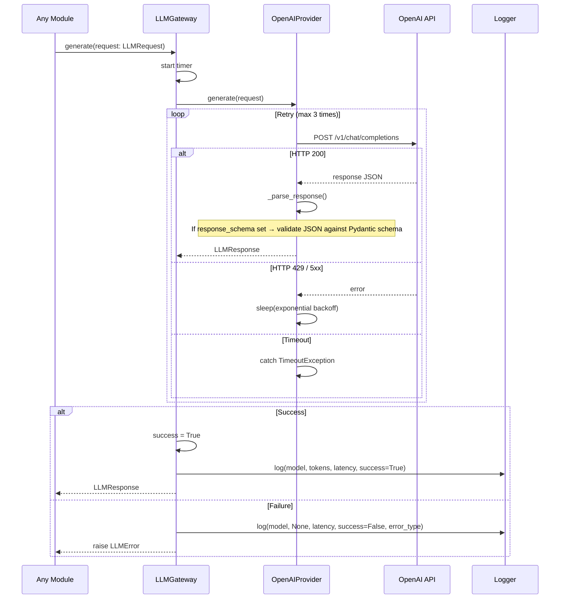
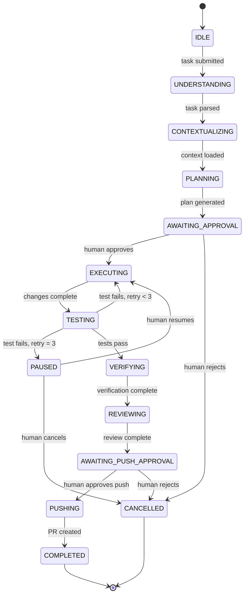
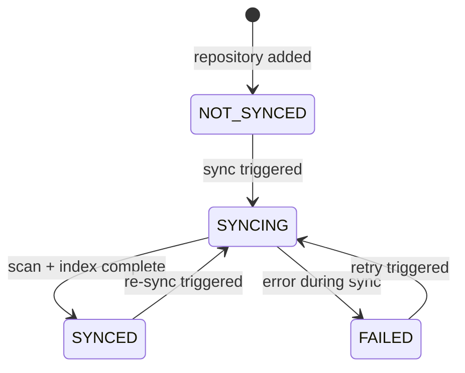
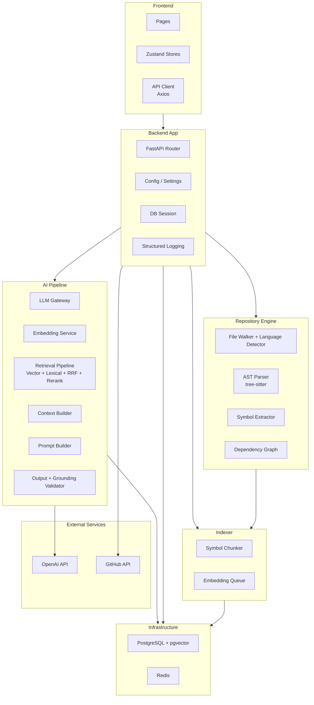

```mermaid
classDiagram
    class LLMProvider {
        <<abstract>>
        +provider_name() str
        +generate(request: LLMRequest) LLMResponse
    }

    class OpenAIProvider {
        -_api_key: str
        -_timeout: float
        -_chat_url: str
        +provider_name() str
        +generate(request: LLMRequest) LLMResponse
        -_build_payload(request) dict
        -_parse_response(data, latency_ms, request) LLMResponse
        -_validate_structured_output(content, schema)
    }

    class LLMGateway {
        -_provider: LLMProvider
        +generate(request: LLMRequest) LLMResponse
    }

    class LLMRequest {
        +model: str
        +messages: list~Message~
        +temperature: float
        +max_tokens: int
        +response_schema: type~BaseModel~ | None
    }

    class LLMResponse {
        +content: str
        +model: str
        +input_tokens: int
        +output_tokens: int
        +latency_ms: float
    }

    class Message {
        +role: "system" | "user" | "assistant"
        +content: str
    }

    class LLMError {
        +retryable: bool
    }
    class LLMTimeoutError
    class LLMRateLimitError
    class LLMUnavailableError
    class LLMValidationError

    class EmbeddingProvider {
        <<abstract>>
        +provider_name() str
        +embedding_dimensions() int
        +embed(text: str) list~float~
        +embed_batch(texts: list~str~) list~list~float~~
    }

    class EmbeddingService {
        -_provider: EmbeddingProvider
        +embed(text: str) list~float~
        +embed_batch(texts: list~str~) list~list~float~~
        -_validate_dimensions(vector)
    }

    class Retriever {
        <<abstract>>
        +retrieve(query, repository_id, top_k) list~CodeChunk~
    }

    class VectorRetriever {
        -_db: AsyncSession
        -_embedding_service: EmbeddingService
        +retrieve(query, repository_id, top_k) list~CodeChunk~
    }

    class LexicalRetriever {
        +retrieve(query, repository_id, top_k) list~CodeChunk~
    }

    class CodeChunk {
        +id: UUID
        +repository_id: UUID
        +file_id: UUID
        +symbol_id: UUID | None
        +content: str
        +token_count: int
        +start_line: int
        +end_line: int
        +content_hash: str
        +score: float
        +file_path: str
    }

    class RRFFusion {
        +fuse(*result_lists, k) list~CodeChunk~
    }

    class CrossEncoderReranker {
        -_model_name: str
        +rerank(query, candidates, top_n) list~CodeChunk~
    }

    class ContextBuilder {
        -_max_tokens: int
        +build(chunks, memory, history, related_files) AgentContext
    }

    class AgentContext {
        +code_chunks: list~CodeChunk~
        +memory_chunks: list~MemoryEntry~
        +related_files: list~RepositoryFile~
        +recent_history: list~ChatMessage~
        +total_tokens: int
    }

    class PromptBuilder {
        +build_chat_prompt(context, question) list~Message~
        +build_summary_prompt(file_path, start_line, end_line, code_content) list~Message~
    }

    class OutputValidator {
        -_gateway: LLMGateway | None
        +validate(raw, schema) tuple~BaseModel|None, bool~
        +repair(raw, schema, error) BaseModel
    }

    class GroundingValidator {
        -_db: object | None
        +validate_sources(answer, repository_id) RepositoryAnswer
        -_check_source(source, repository_id) GroundingResult
    }

    class RepositoryAnswer {
        +answer: str
        +sources: list~SourceReference~
        +confidence: "high"|"medium"|"low"
    }

    class SourceReference {
        +file: str
        +start_line: int
        +end_line: int
        +symbol: str | None
        +line_range() str
    }

    LLMProvider <|-- OpenAIProvider
    LLMGateway --> LLMProvider
    LLMRequest --> Message
    LLMError <|-- LLMTimeoutError
    LLMError <|-- LLMRateLimitError
    LLMError <|-- LLMUnavailableError
    LLMError <|-- LLMValidationError
    EmbeddingService --> EmbeddingProvider
    Retriever <|-- VectorRetriever
    Retriever <|-- LexicalRetriever
    VectorRetriever --> EmbeddingService
    VectorRetriever --> CodeChunk
    RRFFusion --> CodeChunk
    CrossEncoderReranker --> CodeChunk
    ContextBuilder --> AgentContext
    OutputValidator --> LLMGateway
    GroundingValidator --> RepositoryAnswer
    RepositoryAnswer --> SourceReference
```

# 06. UML Diagrams
> **Version:** 1.0 | **Created:** 2026-09-24 | **Last Updated:** 2026-09-24

---

## Diagram Registry

| Diagram | Type | Status | Last Updated |
|---|---|---|---|
| Use Case Diagram | Use Case | ✓ Current | 2026-09-24 |
| Activity: RAG Pipeline | Activity | ✓ Current | 2026-09-24 |
| Activity: Agentic Loop | Activity | ✓ Based on design | 2026-09-24 |
| Class Diagram (AI Layer) | Class | ✓ Current | 2026-09-24 |
| Class Diagram (App Layer) | Class | Partial (stubs) | 2026-09-24 |
| Sequence: LLM Gateway Call | Sequence | ✓ Current | 2026-09-24 |
| Sequence: Repository Chat | Sequence | ✓ Current | 2026-09-24 |
| State: Agent Execution | State | Based on design | 2026-09-24 |
| State: Repository Sync | State | Based on design | 2026-09-24 |
| Component Diagram | Component | ✓ Current | 2026-09-24 |

---

## 6.1 Use Case Diagram

**Purpose:** Shows what each actor can do with the platform.
**Source:** `project_idea.md`, `team_rules.md`, `App.tsx`

---

## 6.2 Activity Diagram: RAG Pipeline

**Purpose:** Shows the exact retrieval flow for repository-aware chat.
**Source:** `backend/ai/retrieval/`, `backend/ai/context/`, `backend/ai/llm/`

---

## 6.3 Activity Diagram: Agentic Task Execution Loop

**Purpose:** Full agent lifecycle from task submission to memory storage.
**Source:** `project_idea.md` section 5 & 6

---

## 6.4 Class Diagram: AI Layer

**Purpose:** Shows actual classes and their relationships in `backend/ai/`.
**Source:** Direct reading of source files.

---

## 6.5 Class Diagram: Scanner & Indexer

**Purpose:** Classes in `backend/scanner/` and `backend/indexer/`.
**Source:** Direct reading of source files.

---

## 6.6 Sequence Diagram: LLM Gateway Call

**Purpose:** Shows internal flow through LLMGateway and OpenAIProvider.
**Source:** `backend/ai/llm/client.py`, `backend/ai/llm/openai_provider.py`

---

## 6.7 State Diagram: Agent Execution

**Purpose:** Agent FSM states.
**Source:** `project_idea.md` section 6 (agent responsibilities)

> [!NOTE]
> Agent FSM is not yet implemented. States are derived from design documentation.

---

## 6.8 State Diagram: Repository Sync

**Purpose:** Sync status of a repository.
**Source:** `Docs/daily_tasks.md` (Om Day 2 — SyncStatus enum)

---

## 6.9 Component Diagram

**Purpose:** Major system components and their relationships.
**Source:** Directory structure + team_rules.md

