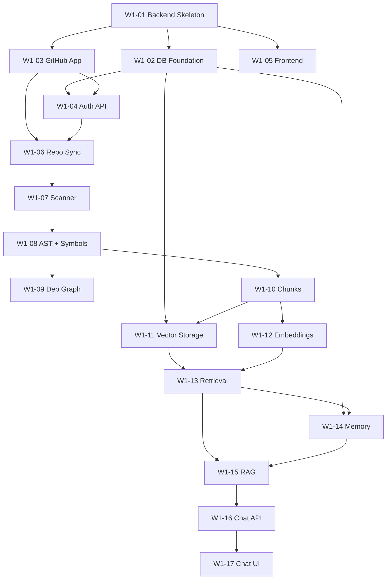

# 10. Development Tasks — Master Task Board
> **Version:** 1.0 | **Created:** 2026-09-24 | **Last Updated:** 2026-09-24

> [!NOTE]
> Task data is derived from `Docs/daily_tasks.md`, `Docs/week1.md`, and current source code state.

---

## Status Legend

```
DONE        — Merged and working
IN PROGRESS — Actively being developed
STUB        — Interface defined, implementation pending
BLOCKED     — Waiting on dependency
TODO        — Not yet started
BACKLOG     — Future sprint
```

---

## Week 1 Task Board

### Week 1 Goal
By Day 7: a user can connect a GitHub repository, the platform clones and scans it, extracts symbols, indexes code into pgvector, and answers repository-specific questions through the frontend with file + line sources.

---

## Infrastructure & Foundation

| Task ID | Task | Owner | Priority | Status | Dependencies | Notes |
|---|---|---|---|---|---|---|
| W1-01 | FastAPI project skeleton | Yug | P0 | DONE | — | `app/main.py`, config, logging, health endpoint |
| W1-01a | `GET /api/v1/health` | Yug | P0 | DONE | W1-01 | Returns `{status:ok, version:1.0.0}` |
| W1-01b | Docker Compose (PG + Redis) | Yug | P0 | DONE | — | `docker-compose.yml` |
| W1-01c | `.env.example` | Yug | P0 | DONE | — | All required keys, no values |
| W1-01d | `RequestIdMiddleware` + structured logging | Yug | P0 | DONE | W1-01 | `app/core/logging.py` |
| W1-02 | DB foundation + pgvector | Om | P0 | STUB | W1-01 | `create_engine`, `Base`, `get_db()` done; models pending |
| W1-02a | `TimestampedModel` mixin | Om | P0 | TODO | W1-02 | UUID PK, created_at, updated_at |
| W1-02b | `CREATE EXTENSION vector` migration | Om | P0 | TODO | W1-02a | Alembic migration |
| W1-19 | Security baseline + pre-commit hooks | Sukun | P0 | TODO | W1-01 | detect-secrets, `.pre-commit-config.yaml` |

---

## Authentication

| Task ID | Task | Owner | Priority | Status | Dependencies | Notes |
|---|---|---|---|---|---|---|
| W1-03 | GitHub App setup | Parth | P0 | TODO | — | App registered, env vars documented |
| W1-04a | `GET /auth/github/login` | Yug | P0 | STUB | W1-03 | OAuth redirect |
| W1-04b | `GET /auth/github/callback` | Yug | P0 | STUB | W1-03, W1-02b | Exchange code → JWT |
| W1-04c | `GET /auth/me` | Yug | P0 | STUB | W1-04b | Return user from JWT |
| W1-04d | `POST /auth/logout` | Yug | P0 | TODO | W1-04b | Redis JWT blocklist |
| W1-04e | `JWTMiddleware` | Yug | P0 | TODO | W1-04b | Auth on all non-auth routes |
| W1-04f | Standard error handler | Yug | P0 | TODO | W1-01 | `{error:{code, message, retryable}}` |

---

## Database Models

| Task ID | Task | Owner | Priority | Status | Dependencies | Notes |
|---|---|---|---|---|---|---|
| W1-OM-01 | `User` SQLAlchemy model | Om | P0 | TODO | W1-02b | `github_id`, `login`, `email`, `avatar_url` |
| W1-OM-02 | `GitHubInstallation` model | Om | P0 | TODO | W1-OM-01 | |
| W1-OM-03 | `Repository` model + `SyncStatus` enum | Om | P0 | TODO | W1-OM-02 | |
| W1-OM-04 | Alembic migration for users/repos/installs | Om | P0 | TODO | W1-OM-03 | |
| W1-OM-05 | `UserRepository` query layer | Om | P0 | TODO | W1-OM-04 | `create_user`, `get_by_github_id`, `get_by_id` |
| W1-OM-06 | `RepositoryRepository` query layer | Om | P0 | TODO | W1-OM-04 | `create`, `get_by_id`, `list_by_user`, `update_sync_status` |
| W1-OM-07 | `repository_files` model + migration | Om | P0 | TODO | W1-OM-04 | Needed by GroundingValidator Day 4 |
| W1-OM-08 | `symbols` + `symbol_edges` models | Om | P0 | TODO | W1-OM-07 | |
| W1-OM-09 | `code_chunks` model + HNSW index migration | Om | P0 | TODO | W1-OM-07 | Critical for vector retrieval |

---

## GitHub Integration

| Task ID | Task | Owner | Priority | Status | Dependencies | Notes |
|---|---|---|---|---|---|---|
| W1-06a | `POST /auth/github/installation` | Parth | P0 | TODO | W1-03, W1-OM-02 | Store installation in DB |
| W1-06b | `InstallationTokenManager` | Parth | P0 | TODO | W1-03 | Redis cache, 55 min TTL |
| W1-06c | `GitHubService` skeleton | Parth | P0 | TODO | W1-06b | `list_repositories`, `clone_repository`, etc. |

---

## Repository Scanner

| Task ID | Task | Owner | Priority | Status | Dependencies | Notes |
|---|---|---|---|---|---|---|
| W1-07a | `FileWalker.walk()` | Prit | P0 | DONE | — | Skip dirs, .gitignore, binary, size limit |
| W1-07b | `LanguageDetector.detect()` | Prit | P0 | STUB | W1-07a | Extension + shebang heuristics |
| W1-08a | tree-sitter parser integration | Prit | P0 | TODO | W1-07b | Python, TS, JS, Java, Go, Rust, C/C++ |
| W1-08b | Symbol extraction | Prit | P0 | TODO | W1-08a | Classes, functions, methods, imports, constants |
| W1-08c | Store symbols in DB | Prit | P0 | TODO | W1-08b, W1-OM-08 | Via Om's repository layer |
| W1-09 | Dependency graph builder | Prit | P0 | STUB | W1-08b | `graph.py` — calls, imports, extends, implements |

---

## Indexer

| Task ID | Task | Owner | Priority | Status | Dependencies | Notes |
|---|---|---|---|---|---|---|
| W1-10a | `SymbolChunker.chunk_symbols()` | Divu | P0 | DONE | — | function/class/module chunk types |
| W1-10b | Embedding queue skeleton | Divu | P0 | TODO | W1-10a | `EmbeddingQueue.enqueue()` + `process_batch()` |
| W1-10c | `ChunkStatus` enum | Divu | P0 | TODO | — | PENDING, PROCESSING, INDEXED, FAILED |
| W1-11 | Store chunks + embeddings in DB | Om/Divu | P0 | TODO | W1-OM-09, W1-12 | Write to `code_chunks` table |

---

## AI / ML Pipeline

| Task ID | Task | Owner | Priority | Status | Dependencies | Notes |
|---|---|---|---|---|---|---|
| W1-12a | `LLMGateway` | Meet | P0 | DONE | — | Retry, logging, structured output |
| W1-12b | `OpenAIProvider` | Meet | P0 | DONE | W1-12a | Chat completions, JSON mode, 3 retries |
| W1-12c | `EmbeddingService` | Meet | P0 | DONE | — | Single + batch, dimension validation |
| W1-12d | `OpenAIEmbeddingProvider` | Meet | P0 | DONE | W1-12c | text-embedding-3-small |
| W1-13a | `VectorRetriever` | Meet | P0 | DONE | W1-OM-09 | pgvector cosine search, repository_id scoping |
| W1-13b | `LexicalRetriever` | Meet | P0 | STUB | W1-OM-09 | PostgreSQL FTS ts_rank |
| W1-13c | `RRFFusion` | Meet | P0 | STUB | W1-13a, W1-13b | k=60, Day 5 |
| W1-13d | `CrossEncoderReranker` | Meet | P0 | STUB | W1-13c | ms-marco-MiniLM-L-6-v2, Day 5 |
| W1-14 | `ContextBuilder.build()` | Meet | P0 | STUB | W1-13d | Day 6: dedup, token count, truncation |
| W1-15a | `PromptBuilder` | Dev | P0 | DONE | — | `build_chat_prompt`, `build_summary_prompt` |
| W1-15b | `OutputValidator.validate()` + `.repair()` | Dev | P0 | DONE | W1-12a | 2-retry repair loop |
| W1-15c | `GroundingValidator.validate_sources()` | Dev | P0 | STUB | W1-OM-07 | DB query stub until Day 4 |
| W1-15d | AI output schemas | Dev | P0 | DONE | — | `RepositoryAnswer`, `SourceReference`, `ErrorResponse` |

---

## Chat API & Frontend

| Task ID | Task | Owner | Priority | Status | Dependencies | Notes |
|---|---|---|---|---|---|---|
| W1-16 | `POST /api/v1/chat` | Yug | P0 | STUB | W1-15 | Full RAG pipeline wired to API |
| W1-17a | Repository Chat page | Dhramraj | P1 | STUB | W1-16 | Chat UI with sources display |
| W1-05a | Frontend project skeleton | Dhramraj | P0 | DONE | — | Vite + React + TypeScript + Zustand |
| W1-05b | Auth store + Protected route | Dhramraj | P0 | DONE | — | `useAuthStore`, `ProtectedRoute` |
| W1-05c | Repository store | Dhramraj | P0 | DONE | — | `useRepositoryStore` |
| W1-05d | Login page | Dhramraj | P0 | STUB | W1-04a | GitHub OAuth button |
| W1-05e | Dashboard page | Dhramraj | P0 | STUB | W1-16 | Repo sync status, recent activity |
| W1-05f | Repositories page | Dhramraj | P0 | STUB | W1-04 | List + sync status |
| W1-05g | Repository Detail page | Dhramraj | P0 | STUB | W1-05f | File count, symbols, status |

---

## Testing

| Task ID | Task | Owner | Priority | Status | Dependencies | Notes |
|---|---|---|---|---|---|---|
| W1-18a | Test infrastructure setup | Keval | P0 | DONE | W1-01 | pytest, pytest-asyncio, httpx, coverage |
| W1-18b | `test_health.py` | Keval | P0 | DONE | W1-01a | Health endpoint returns 200 |
| W1-18c | `test_llm_gateway.py` | Keval | P0 | DONE | W1-12a | LLM gateway tests |
| W1-18d | `test_embedding_service.py` | Keval | P0 | DONE | W1-12c | Embedding service tests |
| W1-18e | `test_vector_retrieval.py` | Keval | P0 | DONE | W1-13a | Vector retriever tests |
| W1-18f | `test_walker.py` | Keval | P0 | DONE | W1-07a | FileWalker tests |
| W1-18g | Auth API tests | Keval | P0 | TODO | W1-04 | |
| W1-18h | Repository API tests | Keval | P0 | TODO | W1-OM-06 | |
| W1-18i | Chat API integration test | Keval | P0 | TODO | W1-16 | End-to-end RAG test |

---

## Week 1 Dependency Graph



---

## Team Assignment Summary

| Member | Active Tasks | Completed |
|---|---|---|
| **Meet** | W1-13b, W1-13c, W1-13d, W1-14 | W1-12a, W1-12b, W1-12c, W1-12d, W1-13a |
| **Yug** | W1-04a–f, W1-16 | W1-01, W1-01a–d |
| **Om** | W1-02a–b, W1-OM-01–09, W1-11 | W1-02 (base) |
| **Parth** | W1-03, W1-06a–c | — |
| **Dhramraj** | W1-05d–g, W1-17a | W1-05a–c |
| **Prit** | W1-07b, W1-08a–c, W1-09 | W1-07a |
| **Divu** | W1-10b–c | W1-10a |
| **Dev** | W1-15c | W1-15a, W1-15b, W1-15d |
| **Keval** | W1-18g–i | W1-18a–f |
| **Sukun** | W1-19 | — |
