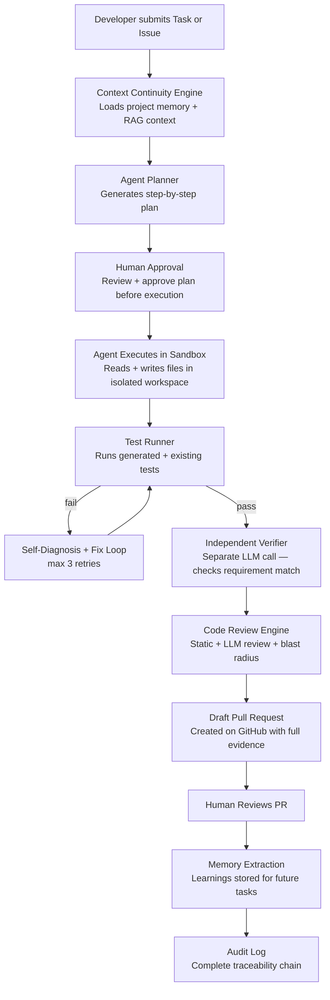
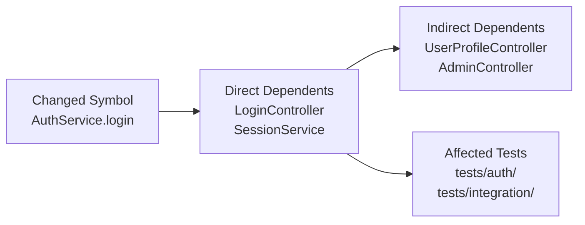
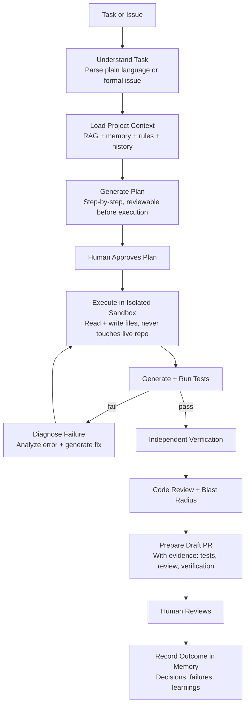
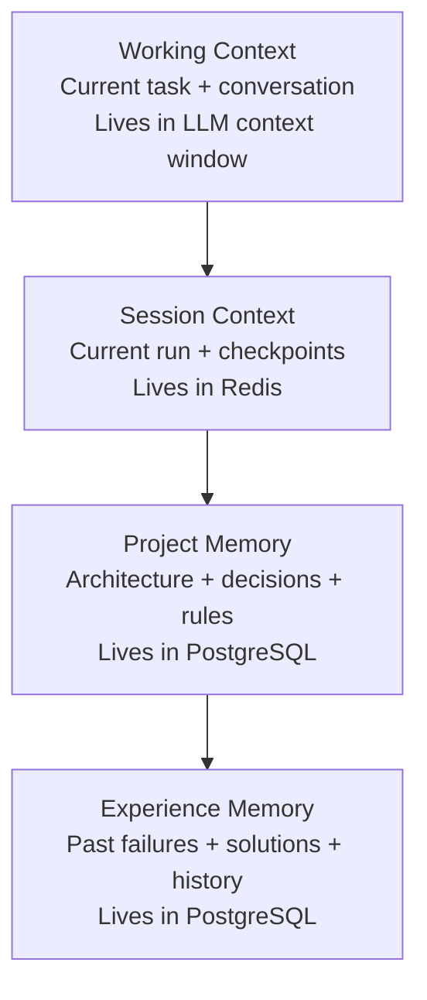
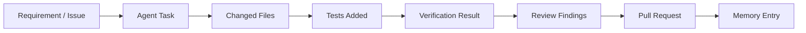

# AI-Powered Agentic Software Engineering Platform
### Project Context & Product Specification

---

## 1. The Problem

Modern software teams juggle code review, testing, debugging, issue tracking, and pull request management across disconnected tools. Each of these activities happens in isolation — a reviewer flags a bug, a tester writes a case, a developer fixes it — with no shared thread connecting *why* the work exists, *what was already tried*, and *what happened last time*.

This fragmentation gets worse with AI involvement. Existing AI coding assistants are **stateless**: every session starts from zero. They don't know the project's architecture, the decisions that shaped it, the rules the team follows, or the approaches that already failed. Developers end up re-explaining context over and over, and AI-generated changes often ignore conventions or repeat mistakes because nothing was remembered.

At the same time, giving an autonomous agent free rein over a codebase is unsafe. Without permissions, sandboxing, and human checkpoints, agentic execution risks unreviewed changes reaching production, runaway loops, or actions no one can trace back to a reason.

**The problem this platform solves:** software engineering work is fragmented, AI assistance is forgetful, and autonomous agents lack the guardrails needed for developers to trust them. Teams need a single system that understands a codebase, remembers its engineering context over time, and lets an agent do real engineering work — safely, transparently, and with a human always in the loop before anything merges.

---

## 2. Product Vision

An AI-powered **Agentic Software Engineering Platform** that integrates with GitHub to understand a project's codebase, remember its engineering context, analyze changes, execute development tasks safely, validate the results, and prepare changes for human approval.

### Who It's For

Software development teams who want AI to do more than comment on pull requests — teams who want an agent that can pick up a task, do the work, and hand back a **verified, reviewable pull request**.

### What It Is

Not just an AI code-review tool. It connects the full engineering loop into one continuous, observable process:

```
Requirement → Codebase Understanding → Analysis → Planning → Implementation
     → Testing → Verification → Draft PR → Human Review → Merge → Project Memory
```

### What Makes It Different

| Differentiator | What It Means |
|----------------|---------------|
| **It remembers** | Architecture, decisions, rules, past attempts, and failures persist across sessions instead of vanishing when a conversation ends |
| **It acts, not just advises** | An agent can plan, implement, test, and self-verify — not only suggest |
| **It stays safe by design** | Every agent action is scoped by permissions, sandboxed, budgeted, and reversible — nothing merges without a human |
| **It stays traceable** | Every change can be followed back to the requirement that motivated it and the evidence that justified it |

### What the Experience Feels Like

A developer hands the platform a task or an issue. The platform **already knows the project** — its structure, its history, its rules, what's been tried before. It plans the work, shows the plan for approval, does the work in an isolated environment, tests and verifies its own output, and returns a draft pull request with clear evidence of what it did and why. The developer reviews, and either merges, asks for changes, or rolls back — and the platform **remembers the outcome for next time**.

---

## 3. Complete System Flow



---

## 4. Feature List

### 4.1 GitHub & Repository

---

#### GitHub Integration `P0`

**Purpose:** The platform works alongside GitHub rather than replacing it, so teams keep their existing workflows.

**What it does:**
- Authenticates users via GitHub OAuth (GitHub App installation)
- Reads repository metadata, branches, files, and git history
- Reads GitHub Issues and pull request details
- Reads CI/CD run results
- Creates draft pull requests with status updates
- Processes GitHub webhook events (push, PR, review) for real-time updates

**Why it matters:** Every other feature depends on a secure, reliable connection to GitHub. Without this, the agent has no source of truth for the codebase and no way to submit its work.

---

#### Repository Engine `P0`

**Purpose:** AI and agents need real structural understanding of a project — not just the changed lines — to give relevant analysis and produce safe changes.

**What it does:**
- Walks the repository file tree, skipping binaries, build artifacts, and `.gitignore` entries
- Detects programming language per file using extension + shebang + content heuristics
- Parses code using **tree-sitter** (production-grade AST parser) for Python, TypeScript, JavaScript, Java, Go, Rust, C/C++
- Extracts symbols: classes, functions, methods, constants, imports, exports — with precise line numbers
- Builds a **dependency graph**: which symbols call, import, extend, or implement which others
- Maps test files to their source counterparts
- Stores all structured knowledge in PostgreSQL for fast querying

**Why it matters:** Line-by-line text search is not enough. The agent needs to know that `AuthController` calls `AuthService.login()`, which imports `jwt`, to understand the blast radius of a change to `jwt`. This is what separates a code-aware agent from a text-completion model.

---

### 4.2 AI Analysis

---

#### AI Code Review `P0`

**Purpose:** Surface correctness, quality, and architectural concerns before they become problems — faster and more consistently than any human reviewer can under time pressure.

**What it does:**
- Reviews each changed file in the context of the full repository (not just the diff)
- Checks for: correctness, bugs, bad practices, performance issues, architectural violations, maintainability problems
- Each finding includes: severity (`critical / high / medium / low`), file + line number, description, evidence (the actual code), and a concrete suggested action
- Runs after the agent's self-verification, before the draft PR is created

**Example finding:**
```json
{
  "severity": "high",
  "file": "src/auth/jwt.service.ts",
  "line": 42,
  "description": "JWT secret is hardcoded — must be read from environment variables",
  "evidence": "const SECRET = 'my-secret-key';",
  "suggested_action": "Replace with: const SECRET = process.env.JWT_SECRET"
}
```

---

#### Bug Detection `P0`

**Purpose:** Catch likely defects that a human reviewer under time pressure might miss.

**What it does:** Flags logical errors, null/undefined dereferences, incorrect boundary conditions, missing edge cases, exception-handling gaps, race conditions, bad state machine transitions, and regression risk in changed code.

---

#### Basic Security Analysis `P0`

**Purpose:** Give teams a first line of defense against common, high-impact security mistakes — without trying to replace a dedicated security product.

**What it detects:**
- Hardcoded secrets, API keys, passwords in source code
- Unsafe input handling (SQL injection, path traversal, XSS)
- Authentication and authorization gaps
- Insecure configuration (debug mode in prod, wide CORS, no rate limits)
- Risky dependency usage (known CVEs)

---

#### Change Impact / Blast-Radius Analysis `P0`

**Purpose:** Help developers and agents understand what a change might break before it ships — a strong differentiator versus line-by-line review.

**What it does:**
- Given a set of changed symbols, traverses the dependency graph using reverse BFS
- Returns: direct dependents, indirect dependents (up to configurable depth), affected test files
- Surfaces this in the review UI so reviewers can see exactly what could break



---

#### Code Explanation `P0`

**Purpose:** Reduce the time developers spend deciphering unfamiliar code, PRs, errors, and failures.

**What it does:** Explains selected code, functions, architecture, PR changes, review findings, error messages, and test failures in plain language — grounded in the actual repository content, not generic descriptions.

---

#### Repository-Aware AI Chat `P1`

**Purpose:** Let developers ask questions about their own codebase and get grounded answers instead of generic ones.

**What it does:**
- Chat interface scoped to a specific repository
- Uses hybrid retrieval (vector + lexical + RRF + reranking) to find relevant code
- Answers include file path + line number sources — verifiable, not hallucinated
- Draws on project memory for context about decisions and architecture

---

### 4.3 Testing & Quality

---

#### Test Generation `P0`

**Purpose:** Ensure changes are covered by relevant tests without relying on developers to remember every case.

**What it does:**
- Generates unit, integration, regression, edge-case, and negative tests
- Tests are informed by: the changed code, the project's existing test conventions (framework, naming patterns, file structure), and the dependency graph (what else might be affected)
- Generated tests follow the project's style — not generic templates

---

#### Test Execution & Result Analysis `P0`

**Purpose:** Give a clear, trustworthy signal on whether a change is actually safe to review.

**What it does:**
- Runs generated and existing tests inside the isolated sandbox
- Reports pass/fail per test suite with full output
- On failure: parses the stack trace, identifies the failing test, locates the related source code, and determines a probable root cause

**Output example:**
```
Status: FAILED
Failing test: JWTService > should sign a token
Root cause: jsonwebtoken imported incorrectly — missing default export
Affected file: src/auth/jwt.service.ts:12
Suggested fix: Change to: import jwt from 'jsonwebtoken'
```

---

#### CI Failure Diagnosis `P0`

**Purpose:** Turn a raw CI failure into an understandable, actionable explanation rather than a wall of logs.

**What it does:** Reads CI failure logs, identifies the failing test, locates related code, determines the root cause, and proposes or applies a targeted fix before re-running CI.

---

#### Independent Verification `P0`

**Purpose:** Avoid the conflict of interest in letting the same agent that wrote code also be the sole judge of whether it's correct.

**What it does:**
- A completely separate LLM call — no shared state with the coding agent
- Sees only: the original task description, the final code diff, and the test results
- Checks: requirement match, test adequacy, edge case coverage, rule compliance
- Returns a structured report, not a score — so reviewers understand exactly what was checked

---

#### Agent Quality Score `P1`

**Purpose:** Give reviewers a fast, structured signal on the quality of an agent's work, without replacing their judgment.

**Scorecard dimensions:** requirement match, implementation quality, test coverage, code quality, security, overall — each with a rating and brief justification.

---

#### Project Standards Engine `P0`

**Purpose:** Encode a team's engineering expectations so agent output consistently meets them.

**What it does:** Stores standing rules (required test coverage thresholds, architectural conventions, security baselines, commit/PR conventions) and checks agent work against them before anything is marked ready for review.

---

### 4.4 Issues & Pull Requests

---

#### Issue Creation `P0`

**Purpose:** Turn AI findings into actionable, trackable work instead of comments that get lost.

**What it does:** Converts an AI finding into a GitHub Issue with: title, description, severity, affected files, evidence snippet, suggested fix, and a link to the related PR if one exists.

---

#### Issue → Automatic Draft PR Agent `P0`

**Purpose:** Close the loop from a reported problem or request to a reviewable solution.

**What it does:**
- Takes a GitHub Issue as input
- Understands the requirement from the issue description
- Retrieves relevant code context via RAG
- Plans the implementation
- Executes the plan in a sandbox
- Tests and verifies the result
- Opens a draft pull request for human review

---

### 4.5 Agentic Development

---

#### Agentic Software Engineering System `P0`

**Purpose:** Extend the platform beyond passive AI review into an agent that can actually do engineering work.

**Full agent capability loop:**



---

#### Natural-Language Development Tasks `P0`

**Purpose:** Let developers hand off work the way they'd describe it to a teammate, not through rigid task forms.

**What it does:** Accepts plain-language requests — *"add pagination to the users API"*, *"fix the bug where session expires too early"*, *"add rate limiting to the login endpoint"* — and converts them into a structured execution plan with identified files, steps, and tests.

---

#### Agent Task Planner `P0`

**Purpose:** Make agent behavior predictable and reviewable before any code changes — rather than a black box.

**What it does:**
- Produces a step-by-step plan before execution begins
- Each step identifies: files to change, tools to use, tests to run
- Developer can approve, reject, or edit the plan
- Agent does not write a single line of code until the plan is approved

**Example plan:**
```
Goal: Add JWT authentication to the REST API

Step 1: Create JWT service
  Files: src/auth/jwt.service.ts (new)
  Tools: write_file

Step 2: Add auth middleware
  Files: src/middleware/auth.ts (modify)
  Tools: read_file, write_file

Step 3: Protect user routes
  Files: src/routes/user.ts (modify)
  Tools: read_file, apply_patch

Tests to run: npm test -- --testPathPattern=auth
```

---

#### Agent Execution Sandbox `P0`

**Purpose:** Ensure autonomous work can never directly affect a developer's machine or the live repository.

**What it does:**
- Runs all agent changes, commands, and tests inside a temporary, isolated container (Docker / gVisor)
- Resource limits enforced: 2 vCPU, 4 GiB RAM, 10 GiB disk, 512 processes
- Network egress denied by default (no phoning home)
- Host filesystem, credentials, and environment variables are completely invisible inside the sandbox
- Workspace is destroyed after the task completes, fails, or is cancelled

---

#### Agent Permission / Policy Engine `P0`

**Purpose:** Ensure an agent's authority matches the risk of the action it's taking.

**Permission tiers:**

| Action | Permission Level |
|--------|-----------------|
| Read files, search code | Always allowed |
| Write files (in sandbox only) | Allowed during EXECUTING state |
| Run tests | Allowed during TESTING state |
| Git commit | Allowed after tests pass |
| Git push to GitHub | Requires explicit human approval |
| Merge PR | Requires explicit human approval |
| Write to production | Always DENIED |

---

#### Agent Self-Verification Loop `P0`

**Purpose:** Require the agent to demonstrate correctness rather than simply asserting it.

**What it does:**
- After making a change, the agent runs tests
- On failure: diagnoses the root cause, generates a targeted fix, applies it, re-runs tests
- Maximum 3 retries per test failure — if still failing, the agent pauses and asks for human input
- Only proceeds to a draft PR after tests pass

---

#### Agent Task Queue `P2`

**Purpose:** Let developers hand off multiple pieces of work without waiting on each one sequentially.

**What it does:** Maintains a queue of pending agent tasks and schedules their execution based on priority and available sandbox capacity.

---

### 4.6 Context Continuity / Memory

---

#### Context Continuity Engine `P0`

**Purpose:** The core differentiator — an agent should never have to relearn a project from scratch.

**What it does:** Preserves important project knowledge across conversations, agent runs, context-window limits, task handoffs, failed attempts, completed tasks, and future sessions — extracting what matters rather than storing everything.

**The four levels of memory:**



---

#### Project Memory `P0`

**Purpose:** Give the agent a standing understanding of what the project is.

**Stores:**
- Project purpose, architecture overview, technology stack
- Entry points, service boundaries, database schema overview
- Important modules and what they do
- External integrations and their contracts

---

#### Decision Memory `P0`

**Purpose:** Prevent the agent from proposing approaches the team has already considered and rejected.

**Stores:** What was decided, why, what was rejected instead, the impact of the decision, and current status (active / superseded / reversed).

**Example entry:**
```
Decision: Use JWT for authentication (not sessions)
Reason: Stateless auth needed for horizontal scaling
Rejected: Redis session store — adds infrastructure dependency
Status: Active
Source: agent:task-abc123 / 2024-01-15
```

---

#### Task Memory `P0`

**Purpose:** Allow work to be picked back up exactly where it left off, across sessions and context resets.

**Stores:** Task goal, current status, completed steps, remaining steps, working branch, last checkpoint.

---

#### Agent Work Memory `P0`

**Purpose:** Preserve a factual record of what an agent actually did, for continuity and audit.

**Stores:** Actions taken during each agent run, files modified, test results, diffs, and the resulting PR.

---

#### Failure Memory `P1`

**Purpose:** Stop the agent from repeating approaches that are already known not to work.

**Stores:** Failed attempts, the root cause of each failure, what to avoid, and what to prefer instead.

---

#### Project Rules `P0`

**Purpose:** Encode standing engineering constraints the agent must always respect.

**Example rules:**
- "All new endpoints must have integration tests"
- "Never push directly to `main`"
- "Database changes require a migration, not raw ALTER TABLE"
- "All secrets must be loaded from environment variables"

---

#### Context Checkpoints `P0`

**Purpose:** Let long-running agent work survive context-window limits without losing important state.

**What it does:** Periodically extracts important information from the current context into a durable checkpoint — objective, completed steps, current state, next step, constraints, relevant files — that a new context window can resume from without starting over.

---

#### Context Retrieval `P0`

**Purpose:** Keep the agent focused by surfacing only what's relevant, rather than overwhelming it with the full memory store.

**What it does:** Ranks and compiles relevant project memory, decisions, related tasks, recent changes, known failures, and rules into the agent's working context for a given task. Uses the same hybrid retrieval (vector + lexical) as the code RAG pipeline.

---

#### Context Conflict Detection `P1`

**Purpose:** Prevent stale memory from misleading the agent when the project has moved on.

**What it does:** Detects when stored memory contradicts the current repository state (e.g., memory says "we use Express.js" but `package.json` now shows Fastify) and prompts the developer to resolve the conflict.

---

#### Memory Versioning `P1`

**Purpose:** Keep the memory store internally consistent as the project evolves.

**Lifecycle states:** `active → superseded → archived → invalid`

---

#### Sensitive Context Protection `P0`

**Purpose:** Ensure sensitive data never ends up persisted in project memory.

**What it does:** Before any content is stored in memory or code chunks, runs a secret scanner that detects and redacts: passwords, API keys, access tokens, private keys, credentials, and sensitive environment variable values.

---

#### Memory Dashboard `P1`

**Purpose:** Give developers visibility into and control over what the system remembers.

**What it shows:** Stored architecture facts, decisions, rules, active/completed tasks, known failures, and checkpoints.

**Controls:** Inspect, correct, delete, archive, mark obsolete, pin (protect from auto-expiry), view the source of each entry.

---

### 4.7 Agent Safety & Control

---

#### Agent Rollback & Recovery `P0`

**Purpose:** Ensure agent work is never a one-way door.

**What it does:**
- Creates recoverable checkpoints throughout an agent run
- Developer can stop the agent, restore a prior checkpoint, discard all changes, or resume from a checkpoint
- Sandbox workspace snapshots allow recovery even from sandbox crashes

---

#### Agent Kill Switch `P0`

**Purpose:** Give developers an immediate, unconditional way to stop agent activity.

**What it does:** Halts a running agent on command — saves the current checkpoint, preserves all task state, and stops immediately. The task can be resumed or cancelled afterward.

---

#### Agent Budget & Resource Limits `P0`

**Purpose:** Prevent runaway agent loops from consuming unbounded time, iterations, or cost.

**Enforced limits:**

| Limit | Default |
|-------|---------|
| Total iterations | 40 |
| Tool calls per step | 15 |
| Test retries per failure | 3 |
| Wall-clock time | 30 minutes |
| LLM token budget | 500k tokens |
| Sandbox CPU time | 60 minutes cumulative |

If any limit is hit: agent saves checkpoint, transitions to PAUSED, and notifies the developer to decide: resume, cancel, or override the limit.

---

#### Human Approval Checkpoints `P0`

**Purpose:** Keep a human in control of the agent by default, rather than fully autonomous execution.

**Mandatory approval gates:**

1. **Before execution begins** — developer must approve the generated plan
2. **Before pushing to GitHub** — developer must confirm the push after seeing diff + review results
3. **Before merging** — developer reviews and merges the PR manually on GitHub

No code reaches GitHub without a human saying yes — twice.

---

#### Cross-Agent Handoff `P2`

**Purpose:** Lay the groundwork for a future multi-agent architecture without committing to its complexity now.

**What it does:** Defines how specialized agents (planning, coding, testing, review) would exchange structured context rather than full conversations — enabling future parallelism and specialization.

---

### 4.8 Traceability

---

#### Requirements → Code → Test → PR Traceability `P0`

**Purpose:** Let anyone answer *"why does this code exist?"* by tracing it back to the requirement that motivated it.

**Traceability chain:**



---

#### Agent Decision / Evidence Trace `P1`

**Purpose:** Make agent actions explainable and auditable without exposing raw internal reasoning.

**What it does:** For each significant agent action, stores a concise summary: task context, evidence behind the decision, confidence level, files affected, and tools used. Visible in the agent activity timeline.

---

### 4.9 Dashboard & Observability

---

#### Agent Activity Timeline `P0`

**Purpose:** Make every agent run auditable, step by step.

**What it shows:** A chronological record of what the agent did — from task receipt through context loading, plan generation, approval, execution (tool calls), testing, correction, review, and PR creation. Every action is timestamped and linked to the relevant file or result.

---

#### Agent Analytics `P2`

**Purpose:** Give teams visibility into agent performance and reliability over time.

**Metrics tracked:** tasks completed, success rate, draft PRs opened, average iterations per task, average execution time, test pass rate on first attempt, human rejection rate, rollback rate, token cost per task.

---

#### Minimal Developer Dashboard `P0`

**Purpose:** Give developers one place to see and act on all platform activity.

**Shows:**
- Repository sync status
- Active agent tasks (with current step)
- Recent review findings requiring attention
- Pending PRs waiting for review
- Memory health (stale entries, conflicts)

---

## 5. Context Continuity Engine — Deep Dive

### Core Idea

The agent should continue work with the important context of the project instead of starting from zero every time.

This is the platform's central differentiator. Instead of treating every session as a blank slate, the system maintains a **living memory** of the project that the agent draws on for every task.

### What the System Remembers

| Memory Type | What Is Stored | Lifecycle |
|-------------|---------------|-----------|
| Project context | Purpose, architecture, technology stack, service map | Long-lived, updated as project evolves |
| Architecture knowledge | Entry points, DB design, APIs, key modules, integrations | Long-lived |
| Important decisions | What was decided, why, what was rejected, dependencies | Active until superseded |
| Project rules | Engineering constraints, testing requirements, PR rules | Always active until explicitly removed |
| Current tasks | In-progress work, completed steps, remaining steps, branch | Active while task is open |
| Agent work history | Actions taken, files modified, results, resulting PRs | Permanent record |
| Failed approaches | What didn't work, why, what to do instead | Active until the problem is solved differently |
| Checkpoints | Extracted state for resuming long-running work | Cleared on task completion |

### What Memory Is NOT

Memory is **not a raw conversation transcript**. The system:
- Extracts and retains useful project knowledge — not every token exchanged
- Keeps knowledge organized by relevance and recency
- Detects when memory has gone stale against the current repository state
- Gives developers full visibility into and control over what's remembered
- Redacts all secrets before storing anything

**The result:** an agent picking up a task already knows what the project is, what's been tried, what's been decided, and where the last attempt left off — without the developer needing to re-explain anything.

---

## 6. Agentic System — Deep Dive

### Agent Responsibilities

Given a task — whether a natural-language request or a GitHub issue — the agent is responsible for:

| Step | What the Agent Does |
|------|---------------------|
| **Understand** | Interprets the task, whether phrased as plain language or a formal issue |
| **Contextualize** | Pulls in relevant project memory, decisions, rules, and history via RAG |
| **Plan** | Produces a clear, step-by-step plan the developer reviews before anything changes |
| **Execute** | Makes required changes inside an isolated sandbox environment |
| **Test** | Generates and/or updates tests, then runs them |
| **Verify** | Confirms the result meets the requirement via an independent check |
| **Prepare PR** | Packages the verified change into a draft PR with supporting evidence |
| **Hand off** | Returns control to the developer, who has full visibility into what was done and why |
| **Record** | Stores the outcome — success, failure, decisions — back into project memory |

### Safety Guarantees

Throughout this loop, the agent operates within:
- **Permission levels** — what the agent is allowed to do depends on the current phase and pre-configured policy
- **Budget limits** — configurable ceilings on iterations, time, token usage, and cost
- **Mandatory human checkpoints** — plan approval before execution, push approval before GitHub, manual merge

Autonomy is always **bounded and reversible**. Every action can be traced back to a reason.

---

## 7. Priority Summary

| Priority | Meaning | Must ship |
|----------|---------|-----------|
| **P0** | Core product — platform does not work without it | Week 1-3 |
| **P1** | Strong product — significantly improves the experience | Week 3 or shortly after |
| **P2** | Future feature — valuable but not critical for initial launch | Post-launch |