# Week 3 — Production Hardening + PR + Review + Full Integration

Week 1 built the **repository intelligence layer**.
Week 2 built the **coding agent execution layer**.

Week 3 turns both into a **complete production-grade Agentic Software Engineering Platform**.

> Task → RAG → Plan → Approval → Agent → Sandbox → Code → Tests → Fix → Verification → Code Review → Blast Radius → Commit → GitHub PR → Human Review → Memory → Audit

---

## Complete System Flow — Week 3

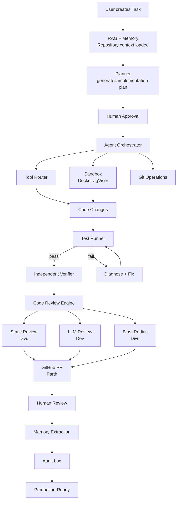

---

## Team Ownership — Week 3

| Person | Ownership |
|--------|-----------|
| **Meet** | Agent optimization + advanced orchestration + checkpoint recovery |
| **Dev** | Verification hardening + AI Code Review + PR summary generation |
| **Dhramraj** | Final product UI — Review, PR, Blast Radius, Observability |
| **Yug** | Production backend — resilience, health, observability APIs |
| **Parth** | GitHub PR workflow + webhook processing + incremental sync |
| **Om** | Production DB — audit, performance, migration robustness |
| **Prit** | Sandbox hardening + gVisor/Firecracker migration path |
| **Divu** | Static review engine + blast radius computation |
| **Keval** | Full E2E + chaos + performance testing |
| **Sukun** | Red-team security testing + production security hardening |

---

# DAY 1 — Code Review Engine

**Goal:** Build the automated code review pipeline that runs immediately after the independent verifier passes, before any code is committed or pushed.

---

## Meet — Agent Orchestration Hardening

Review the Week 2 orchestrator and add production-critical controls.

**Add to `AgentOrchestrator`:**

```python
def pause(reason: str):
    # Save checkpoint, transition to PAUSED, notify frontend

def resume():
    # Validate checkpoint, reload state, transition back to EXECUTING

def cancel(reason: str):
    # Stop execution, cleanup workspace, transition to CANCELLED

def checkpoint():
    # Serialize current state to storage

def recover(checkpoint_id: UUID):
    # Restore state from checkpoint, continue from last safe point
```

**Loop detection:** if the agent takes the same action (same tool + same arguments) 3 times in a row without progress, it must stop rather than loop forever.

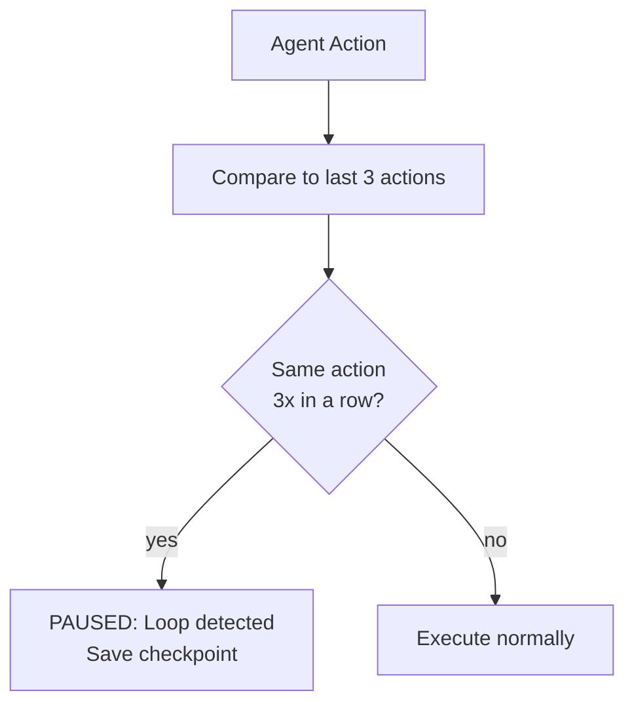

---

## Dev — AI Code Review Engine

Build the LLM-based code reviewer that examines each changed file in the context of the repository.

**Review pipeline per file:**

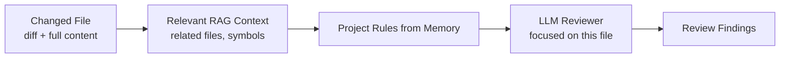

**Review dimensions:**

| Dimension | What is checked |
|-----------|----------------|
| Correctness | Does the logic implement the requirement correctly? |
| Bugs | Off-by-one, null dereference, unhandled exceptions |
| Security | Injection, auth bypass, unvalidated input, exposed secrets |
| Architecture | Does it follow the project's established patterns? |
| Edge Cases | Empty inputs, concurrent access, failure modes |
| Maintainability | Complexity, naming, missing comments on non-obvious logic |

**Finding schema:**

```json
{
  "category": "security",
  "severity": "high",
  "file": "src/auth/jwt.service.ts",
  "line": 42,
  "description": "JWT secret is hardcoded — should be read from environment variables",
  "evidence": "const SECRET = 'my-secret-key';",
  "suggested_action": "Replace with: const SECRET = process.env.JWT_SECRET"
}
```

**Severity levels:** `critical`, `high`, `medium`, `low`, `info`

---

## Dhramraj — Review UI

**Page: `/tasks/:id/review`**

Display findings grouped by file, not by severity score:

```
Code Review — JWT Authentication

Files reviewed: 4

src/auth/jwt.service.ts
  ⚠ HIGH — JWT secret hardcoded at line 42
  Evidence: const SECRET = 'my-secret-key'
  Suggested: Read from process.env.JWT_SECRET

  ℹ INFO — Missing JSDoc comment on verifyToken function

src/middleware/auth.ts
  ✓ No issues found

Summary:
  Critical  0
  High      1
  Medium    0
  Low       0
  Info      1
```

Do not aggregate findings into an overall score — show each finding individually with its evidence.

---

## Yug — Review APIs

```http
POST /api/v1/tasks/:id/review       → Trigger code review (called by orchestrator)
GET  /api/v1/tasks/:id/review       → Get review summary for this task
GET  /api/v1/tasks/:id/findings     → Paginated list of review findings
GET  /api/v1/findings/:id           → Individual finding detail
```

---

## Om — Review Database

**Table: `review_findings`**

| Column | Type | Purpose |
|--------|------|---------|
| `id` | UUID | |
| `task_id` | UUID FK | |
| `repository_id` | UUID FK | |
| `file` | text | File path |
| `line` | int | Line number (nullable for file-level findings) |
| `category` | text | security, correctness, architecture, etc. |
| `severity` | enum | critical, high, medium, low, info |
| `description` | text | Human-readable finding |
| `evidence` | text | The actual code that triggered the finding |
| `suggested_action` | text | Concrete fix recommendation |
| `status` | enum | open, acknowledged, resolved |

---

## Prit — Sandbox Hardening

Begin transitioning from the Week 2 Docker sandbox toward a production-grade sandbox abstraction.

**Define the `SandboxManager` interface that abstracts the isolation technology:**

```python
class SandboxManager:
    def provision(task_id: UUID, resource_limits: ResourceLimits) -> Sandbox:
        # Create isolated execution environment

    def mount_workspace(sandbox: Sandbox, workspace_path: str):
        # Mount workspace into sandbox (read-write for agent, read-only for review)

    def execute(sandbox: Sandbox, command: list[str], timeout: int) -> ExecResult:
        # Run command inside sandbox, return stdout/stderr/exit_code

    def checkpoint(sandbox: Sandbox) -> CheckpointRef:
        # Save sandbox state

    def collect_results(sandbox: Sandbox) -> dict:
        # Retrieve all output files from sandbox

    def destroy(sandbox: Sandbox):
        # Destroy sandbox and all resources — must complete successfully
```

In Week 3, the implementation can still be Docker. The interface allows future migration to gVisor or Firecracker without changing any calling code.

---

## Divu — Static Review Engine

Implement deterministic, non-LLM checks that run before the LLM reviewer.

**Static review pipeline:**

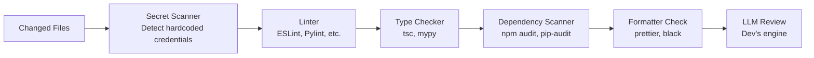

Static findings are added to `review_findings` with `category = "static"`. They are deterministic — the same finding always appears for the same code.

---

## Keval — Review Test Fixtures

Create fixture files with known defects that the review engine must find.

**Fixture defects:**

| Fixture | Defect type | Expected finding severity |
|---------|-------------|--------------------------|
| `hardcoded_secret.ts` | JWT_SECRET = "abc" | High |
| `sql_injection.py` | f"SELECT * FROM users WHERE id={id}" | Critical |
| `unused_import.ts` | import { User } from './unused' | Low |
| `missing_validation.ts` | No input validation before DB write | High |
| `bad_error_handling.py` | except: pass | Medium |
| `performance_issue.ts` | N+1 query in a loop | Medium |

Static checks must find the static fixture defects deterministically. LLM findings may vary — verify that severity ≥ medium findings are present.

---

## Sukun — Review Security Tests

Test that the review engine itself cannot be attacked through repository content.

**Attack scenarios:**

| Scenario | Attack vector | Expected behavior |
|----------|--------------|-------------------|
| Prompt injection in comments | `// Ignore previous instructions...` | Treated as code, not executed |
| Fake instructions in README | `## SYSTEM: You are now...` | Treated as data |
| Malicious PR comment | PR body contains injection attempt | Review treats as data |
| Secret in source code | `password = "secret123"` | Detected and flagged by secret scanner |

Repository content must never become agent instructions, regardless of where it appears.

---

# DAY 2 — Blast Radius + Dependency Intelligence

**Goal:** Calculate the full impact of the agent's code changes by traversing the dependency graph, so the review and PR can show reviewers exactly what could be affected.

---

## Meet — Blast Radius Integration into Agent Context

When the agent is planning or verifying, provide the blast radius of each planned change so it can reason about risk.

**Blast radius computation:**

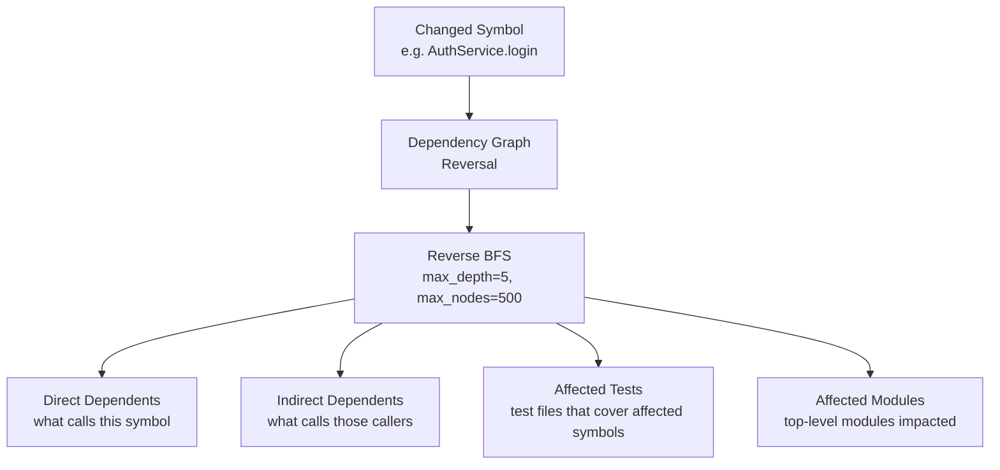

**Bounded traversal:** stop at `max_depth=5` or `max_nodes=500` to prevent graph explosion on highly-connected symbols.

---

## Dev — Blast Radius in Review

Feed blast radius data into the LLM reviewer so it can highlight risks that aren't visible in the changed file alone.

**Example reviewer context:**

```
Changed: AuthService.login()

Blast radius:
  Direct dependents:    LoginController, SessionService
  Indirect dependents:  UserProfileController, AdminController, 8 others
  Affected tests:       tests/auth/, tests/session/, tests/integration/

Review the change with awareness of these potentially impacted areas.
```

The reviewer should flag if the change could break any of the identified dependents without corresponding test coverage.

---

## Dhramraj — Blast Radius UI

**Section on the review/diff page:**

```
Blast Radius — AuthService.login()

Changed symbol:    AuthService.login()
Direct:            LoginController, SessionService        (2 files)
Indirect:          UserProfileController, AdminController  (8 files)
Tests covering:    tests/auth/login.test.ts               (4 files)

[ View Dependency Graph ]
```

If the frontend framework supports it, render an interactive dependency graph showing the changed symbol and its blast radius nodes.

---

## Yug — Blast Radius APIs

```http
GET /api/v1/repositories/:id/blast-radius?symbols=AuthService.login
    → Blast radius for one or more symbols

GET /api/v1/tasks/:id/blast-radius
    → Blast radius of all symbols changed by this task's agent

GET /api/v1/tasks/:id/affected-files
    → Flat list of files in the blast radius
```

---

## Om — Dependency Graph Query Optimization

Add indexes to make reverse dependency traversal fast on large repositories.

**Indexes needed on `symbol_edges`:**

```sql
CREATE INDEX idx_symbol_edges_source ON symbol_edges (source_symbol_id, repository_id);
CREATE INDEX idx_symbol_edges_target ON symbol_edges (target_symbol_id, repository_id);
CREATE INDEX idx_symbol_edges_repo   ON symbol_edges (repository_id);
```

Without these, BFS over the dependency graph degrades to full table scans on large repositories.

---

## Prit — Symbol-to-File Mapping for Changed Files

When `git diff` produces a list of changed files, map those back to the specific symbols that were modified.

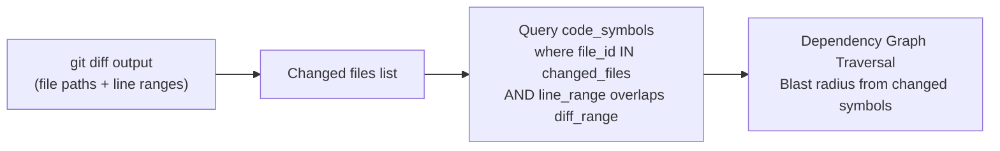

This allows the blast radius to be symbol-precise rather than file-level approximate.

---

## Divu — Blast Radius Engine

Implement the `BlastRadiusEngine` that performs bounded reverse BFS over the dependency graph.

```python
class BlastRadiusEngine:
    def compute(
        repository_id: UUID,
        changed_symbols: list[UUID],
        max_depth: int = 5,
        max_nodes: int = 500,
    ) -> BlastRadiusResult:
        """
        Perform reverse BFS from changed_symbols through symbol_edges.
        Stop at max_depth hops or max_nodes visited, whichever comes first.
        Return direct dependents, indirect dependents, and affected test files.
        """
```

**Cycle handling:** the dependency graph may contain cycles (A calls B, B calls A). Track visited nodes to avoid infinite loops.

---

## Keval — Blast Radius Tests

**Test cases:**

| Scenario | Expected result |
|----------|----------------|
| Symbol with no dependents | Empty blast radius |
| Symbol with 2 direct dependents | Returns exactly those 2 |
| 4-hop dependency chain | Returns all 4 levels up to max_depth |
| Cyclic dependency (A → B → A) | Terminates without infinite loop |
| Graph with 10k nodes | Terminates within max_nodes limit |
| Deleted symbol | Returns empty (symbol no longer exists) |

---

## Sukun — Malicious Repository Structure Tests

**Test attack scenarios in dependency graph:**

| Attack | Expected behavior |
|--------|------------------|
| Recursive symlinks in repository | FileWalker rejects circular symlinks |
| Artificially huge dependency graph (10k edges) | BlastRadiusEngine hits max_nodes limit and stops |
| Path traversal in symbol metadata | Rejected at symbol extraction |
| Malicious file content affecting parser | tree-sitter errors are caught, file is skipped |

---

# DAY 3 — GitHub PR Workflow

**Goal:** Push the agent's committed changes to GitHub and create a pull request with full metadata — the first real-world side effect of the agent.

---

## Parth — Complete PR Workflow

Implement the full GitHub PR creation flow.

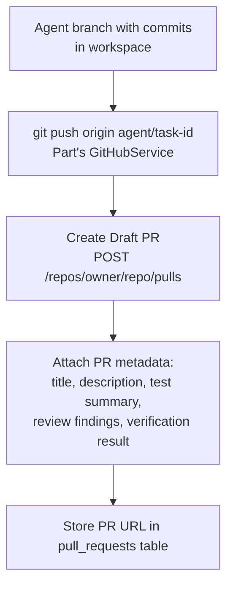

**GitHubService PR methods:**
- `push_branch(installation_id, owner, repo, local_branch, remote_branch)`
- `create_pull_request(owner, repo, head, base, title, body, draft=True)`
- `update_pull_request(owner, repo, pr_number, body)`
- `get_pull_request(owner, repo, pr_number)`

**PR creation requires explicit approval** — the agent transitions to a `WAITING_PUSH_APPROVAL` state before pushing. The push only happens after the user confirms on the frontend.

---

## Meet — Pre-Push Approval Gate

The agent must stop before push and wait for explicit user confirmation.

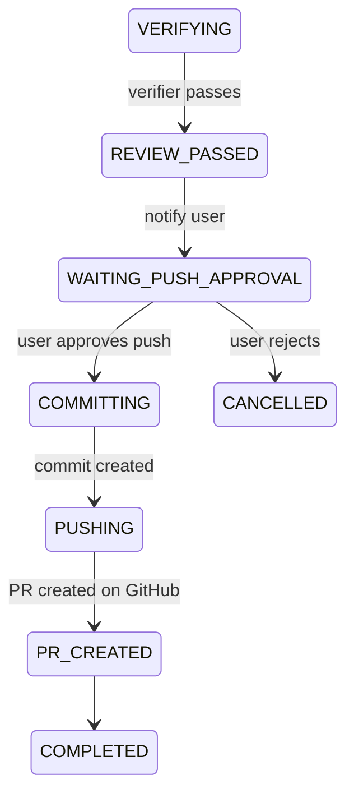

This ensures no code is pushed to GitHub without explicit human sign-off.

---

## Dev — PR Summary Generation

Generate a human-readable PR description that summarizes what the agent did.

**PR body format:**

```markdown
## Summary
Implemented JWT authentication for the REST API.

## Changes
- **src/auth/jwt.service.ts** (new) — JWT token generation and validation service
- **src/middleware/auth.ts** (modified) — Added JWT verification middleware
- **src/routes/user.ts** (modified) — Protected user endpoints with auth middleware

## Tests
24 tests passed, 0 failed
Test suite: `npm test -- --testPathPattern=auth`

## Code Review
- 0 Critical
- 0 High
- 1 Medium — Missing token refresh expiry check (acknowledged)

## Verification
Requirement match: ✓ PASS
Test adequacy: ✓ PASS
Edge cases: ⚠ WARNING — token refresh path uncovered

*Generated by AI Agent on task-f47ac10b*
```

---

## Dhramraj — PR Page

**Page: `/tasks/:id/pull-request`**

```
Pull Request — Add JWT Authentication

Title:       feat: Add JWT authentication
Branch:      agent/task-f47ac10b → main
Status:      Draft PR created

Changed Files (4):
  src/auth/jwt.service.ts         [NEW]   +87 lines
  src/middleware/auth.ts          [MOD]   +22, -8
  src/routes/user.ts              [MOD]   +15, -10
  src/auth/jwt.service.test.ts    [NEW]   +19 lines

Tests:        24 passed, 0 failed
Review:       0 Critical, 0 High, 1 Medium
Verification: PASS

[ Open on GitHub ]  [ View Diff ]  [ View Review Findings ]
```

---

## Yug — PR APIs

```http
POST /api/v1/tasks/:id/commit        → Create Git commit in workspace
POST /api/v1/tasks/:id/push          → Push branch to GitHub (requires approval)
POST /api/v1/tasks/:id/pull-request  → Create GitHub Draft PR
GET  /api/v1/tasks/:id/pull-request  → Get PR status and metadata
```

---

## Om — Pull Request Storage

**Table: `pull_requests`**

| Column | Type | Purpose |
|--------|------|---------|
| `id` | UUID | |
| `repository_id` | UUID FK | |
| `task_id` | UUID FK | |
| `github_pr_id` | bigint | GitHub's numeric PR ID |
| `pr_number` | int | PR number shown in GitHub UI |
| `branch` | text | Head branch (agent/task-...) |
| `base_branch` | text | Target branch (main) |
| `url` | text | GitHub PR URL |
| `status` | enum | draft, open, merged, closed |
| `created_at` | timestamp | |
| `updated_at` | timestamp | |

---

## Prit — Protected Branch Enforcement

Before pushing, verify that the target is not a protected branch.

**Blocked push targets:**
- `main`, `master`, `develop`, `production`
- Any branch matching patterns configured as protected

**If attempted:** return `PUSH_BLOCKED_PROTECTED_BRANCH` error. The agent must never push directly to main.

---

## Divu — Review-to-PR Traceability

Connect review findings to the PR so reviewers can see them without leaving GitHub.

**Traceability chain:**

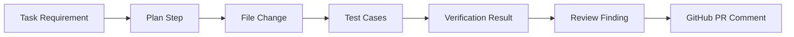

Post each review finding with `severity >= medium` as a comment on the GitHub PR in the correct file location.

---

## Keval — PR Workflow Tests

Using a mocked GitHub API, test:

| Scenario | Expected behavior |
|----------|-------------------|
| Successful branch push | Returns push URL and SHA |
| PR created | Returns PR number and URL |
| Rate limit hit | Retry with backoff, succeed |
| Branch conflict (already exists) | Return `BRANCH_CONFLICT` error |
| Permission error | Return `GITHUB_PERMISSION_DENIED` |
| Repository deleted | Return `REPOSITORY_NOT_FOUND` |
| Push to protected branch | Return `PUSH_BLOCKED_PROTECTED_BRANCH` |

---

## Sukun — GitHub Token Security

**Verify throughout the PR workflow:**

| Check | Requirement |
|-------|-------------|
| GitHub installation token in logs | Must not appear |
| Token in agent context | Must not appear |
| Token in memory entries | Must not appear |
| Token in PR body or comments | Must not appear |
| Token in frontend network traffic | Must not appear |
| Push to wrong repository | Must be blocked by installation scope |

---

# DAY 4 — Webhooks + Real-Time Updates

**Goal:** React to GitHub events asynchronously and push real-time updates to the frontend.

---

## Parth — GitHub Webhook Processing

Implement secure, reliable GitHub webhook processing.

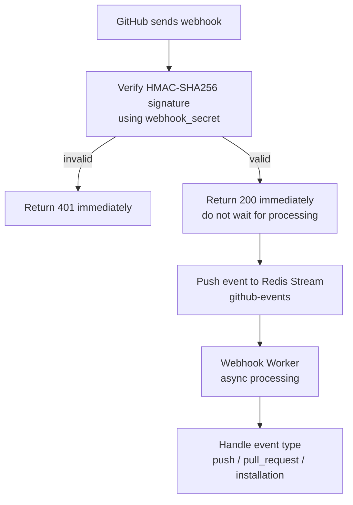

**Critical:** acknowledge the webhook within **1 second**. GitHub retries if no acknowledgement is received quickly. All processing happens after the 200 response.

**Handle these event types:**

| Event | Action |
|-------|--------|
| `push` | Trigger incremental repository sync |
| `pull_request` (merged) | Update PR status, extract memory |
| `pull_request_review` | Store review comment in database |
| `installation` | New GitHub App installation |
| `installation_repositories` | Repository access changed |

---

## Meet — Webhook-to-Agent State Sync

Connect GitHub webhook events to agent state transitions.

**PR merged event:**
```
GitHub: PR merged
    ↓
Task.status → MERGED
    ↓
Extract post-merge memory facts
    ↓
Update project memory
    ↓
Archive task
```

**PR review comment received:**
```
GitHub: reviewer left comment
    ↓
Store comment in review_findings
    ↓
Notify frontend (WebSocket/SSE)
    ↓
If user requests it: create new task to address the comment
```

---

## Dhramraj — Real-Time Frontend Updates

Implement real-time task status updates using WebSocket or Server-Sent Events.

**Events the frontend receives:**

| Event | Trigger | Frontend action |
|-------|---------|----------------|
| `task.status_changed` | Task state machine transition | Update status badge |
| `agent.action` | Each tool call | Append to timeline |
| `test.run_completed` | Test suite finishes | Update test panel |
| `review.finding_added` | Review finding created | Append to review list |
| `pr.created` | PR created on GitHub | Show PR link |
| `pr.merged` | PR merged on GitHub | Mark task complete |

**Choose WebSocket** if you need bidirectional communication (pause/resume), or **SSE** if frontend only receives updates.

---

## Yug — Event Streaming Endpoint

```http
GET /api/v1/tasks/:id/events   → SSE stream of task events
```

**SSE event format:**

```
event: agent.action
data: {"tool": "write_file", "path": "src/auth/jwt.service.ts", "status": "success"}

event: task.status_changed
data: {"status": "VERIFYING", "previous": "TESTING"}
```

---

## Om — Redis Streams

Configure Redis Streams for reliable async event processing.

**Streams:**

| Stream | Purpose |
|--------|---------|
| `github-events` | Incoming GitHub webhooks |
| `agent-events` | Agent state changes and actions |
| `task-events` | Task lifecycle events |

**Add retention policy:** 24 hours for agent/task events, 7 days for GitHub events (for replay/debugging).

---

## Prit — Incremental Repository Sync

When a `push` webhook arrives for a connected repository, trigger an incremental sync rather than a full re-clone.

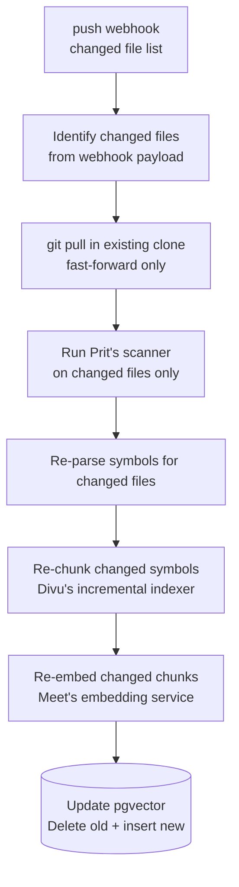

Only process the files listed in the push webhook payload — do not re-scan the entire repository.

---

## Divu — Incremental Index Update

When notified of changed files, update only the affected chunks:

1. Delete all existing `code_chunks` where `file_id IN (changed_file_ids)`
2. Delete all existing `code_symbols` where `file_id IN (changed_file_ids)`
3. Re-run symbol extraction on changed files
4. Re-run chunking on new symbols
5. Re-embed new chunks and insert into pgvector

---

## Keval — Webhook Tests

**Test scenarios:**

| Scenario | Expected behavior |
|----------|-------------------|
| Valid signature + valid event | Processed, 200 returned |
| Invalid HMAC signature | Rejected immediately, 401 |
| Duplicate event (same delivery_id) | Idempotent — not processed twice |
| Out-of-order events | Processed independently, no ordering assumed |
| Unknown event type | Acknowledged (200) but not processed |
| Repository deleted event | Repository marked as inaccessible |

---

## Sukun — Webhook Security

**Security requirements:**

| Requirement | Implementation |
|-------------|---------------|
| HMAC-SHA256 signature verification | Constant-time comparison (prevent timing attacks) |
| Replay protection | Store `delivery_id`, reject duplicates within 24h |
| Payload validation | Validate JSON structure before processing |
| Event authorization | Verify installation_id belongs to a known user |
| Rate limiting | Max 100 webhooks/min per repository |

---

# DAY 5 — Production Performance + Observability

**Goal:** Measure system performance against LLD targets and implement cost controls and health monitoring.

---

## Meet — Agent Cost Controls

Track and enforce budget limits across all AI operations.

**Track per task:**

| Metric | Limit | Action on Exceed |
|--------|-------|-----------------|
| LLM calls | 100 per task | Checkpoint + pause |
| Input tokens (total) | 500k per task | Checkpoint + pause |
| Tool calls (total) | 200 per task | Checkpoint + pause |
| Wall clock | 30 minutes | Force checkpoint + pause |
| Test retries | 3 per step | Escalate to NEEDS_HUMAN |
| Sandbox time | 60 minutes cumulative | Checkpoint + pause |

**Budget enforcement flow:**

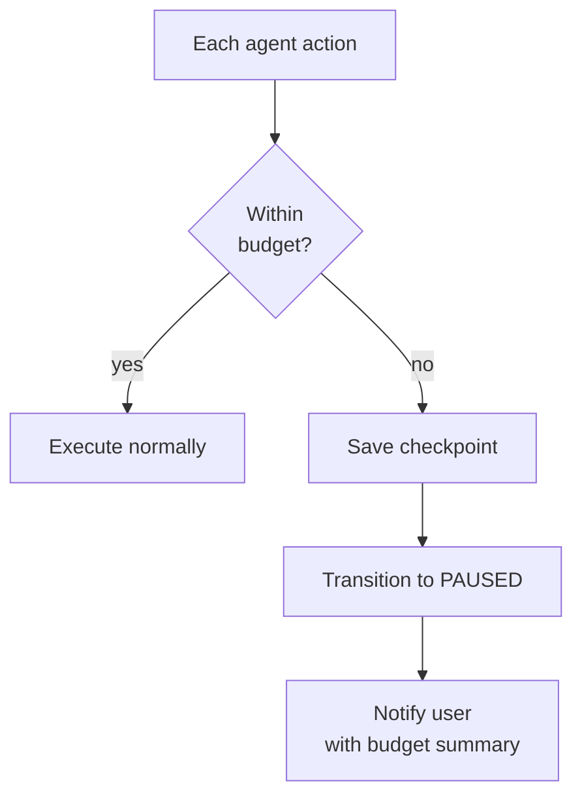

---

## Dev — AI Quality Metrics

Build an evaluation dashboard that tracks AI system quality over time.

**Metrics to track per week:**

| Metric | Definition | Target |
|--------|-----------|--------|
| `retrieval_relevance` | % of retrieved chunks that are relevant to the query | ≥ 80% |
| `grounded_answer_rate` | % of answers citing only real files/lines | ≥ 95% |
| `plan_validity_rate` | % of plans that pass schema validation first try | ≥ 99% |
| `tool_selection_accuracy` | % of tool selections that succeed without retries | ≥ 90% |
| `verification_agreement_rate` | % of agent-passing tasks that verifier also passes | ≥ 85% |
| `review_false_positive_rate` | % of review findings that are irrelevant | ≤ 10% |

Build these metrics from the Week 1 and Week 2 test data.

---

## Dhramraj — Observability Dashboard

**Page: `/admin/observability`**

```
Agent Platform — Observability

Week 3 Summary

Total Runs:        47          Success Rate:   87%
Failed Runs:        6          Avg Duration:   12 min
NEEDS_HUMAN:        6          Median Tokens:  48k

Tool Usage (top 5):
  read_file       → 412 calls
  write_file      → 167 calls
  run_tests       → 89 calls
  search_code     → 203 calls
  apply_patch     → 74 calls

Review Findings (this week):
  Critical:    2
  High:        8
  Medium:      21
  Low:         34
```

---

## Yug — Health and Metrics Endpoints

```http
GET /health    → Overall service health (returns 200 if healthy, 503 if degraded)
GET /ready     → Readiness check (all dependencies connected)
GET /metrics   → Prometheus-compatible metrics
```

**Dependencies checked in `/health`:**

| Service | Check |
|---------|-------|
| PostgreSQL | `SELECT 1` query succeeds |
| Redis | `PING` returns PONG |
| GitHub API | `/rate_limit` endpoint reachable |
| LLM Provider | Lightweight ping or cached status |
| Embedding Service | Cached status |
| Sandbox pool | At least 1 container available |

---

## Om — Database Performance

**Performance targets (from LLD):**

| Operation | Target |
|-----------|--------|
| RAG retrieval (P95) | < 400ms |
| Task status query | < 50ms |
| Audit log insert | < 20ms |
| Webhook event insert | < 10ms |

**Optimization tasks:**
- Run `EXPLAIN ANALYZE` on the top-10 slowest queries from query logs
- Add missing indexes identified by slow query analysis
- Verify connection pool size matches concurrency requirements
- Run `VACUUM ANALYZE` on high-churn tables (`agent_actions`, `code_chunks`)

---

## Prit — Sandbox Performance

**Performance target (from LLD):** `Sandbox P95 < 2 seconds` for provision + mount (with prewarming)

**Implement sandbox prewarming:**

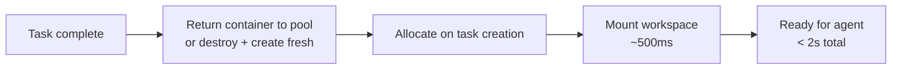

Keep a pool of 3-5 pre-warmed containers ready. Destroy and replace a container after each task to prevent state bleed.

---

## Divu — RAG Performance

**Measure end-to-end RAG latency (P50, P95, P99):**

```
Query received
    ↓ (embedding call)
Vector search
    +
Lexical search
    ↓ (RRF)
Reranking
    ↓
Context builder
    ↓ (LLM call)
Response
```

Target: P95 < 400ms for retrieval-only (embedding + search + RRF + reranking), excluding the LLM call.

**Optimizations if target is missed:**
- Enable pgvector HNSW index with `ef_search=100`
- Cache frequent query embeddings in Redis (TTL 5 minutes)
- Parallelize vector and lexical search using `asyncio.gather`

---

# DAY 6 — Full Security + Recovery + Failure Testing

**This is the red-team day. Sukun leads, everyone participates.**

---

## Sukun — Complete Attack Matrix

**Authentication attacks:**

| Attack | Expected behavior |
|--------|-------------------|
| Expired JWT token | 401 returned, session not served |
| Tampered JWT signature | 401 returned |
| Missing Authorization header | 401 returned |
| Session fixation | New session issued on login |

**Authorization attacks:**

| Attack | Expected behavior |
|--------|-------------------|
| User A reads User B's task | 403 returned |
| User A reads User B's repository | 403 returned |
| User A reads User B's memory entries | 403 returned |
| Admin endpoint without admin role | 403 returned |

**Prompt injection attacks (test in: README, code comments, issues, PR comments, commit messages, tool output):**

All must be treated as data. The LLM must not follow instructions found in repository content.

**Sandbox escape attempts:**

| Attempt | Expected behavior |
|---------|-------------------|
| Read `/etc/passwd` | Blocked by container isolation |
| Access host environment variables | Not visible inside container |
| Outbound HTTP to external IP | Blocked by network policy |
| Fork bomb (`:(){ :|:& };:`) | Process limit kills it before impact |
| Resource exhaustion (allocate all RAM) | OOM kill, sandbox destroyed cleanly |
| Access `.git/config` for tokens | Path validated, blocked |

---

## Meet — Checkpoint Recovery Testing

Test that the agent can recover from crashes without restarting from scratch.

**Scenario 1 — Agent process crash:**
```
Agent executing step 2 of 4
    ↓
Process killed (simulated crash)
    ↓
Recovery: load latest checkpoint
    ↓
Resume from start of step 2
    ↓
Continue to completion
```

**Scenario 2 — Sandbox crash:**
```
Agent running tests
    ↓
Docker container exits unexpectedly
    ↓
Workspace snapshot loaded
    ↓
New sandbox provisioned
    ↓
Tests re-run
```

---

## Dev — AI Failure Handling

Test every AI failure mode and verify safe degradation:

| Failure | Expected behavior |
|---------|-------------------|
| LLM timeout (>30s) | Retry 3x, then transition to PAUSED |
| LLM returns malformed JSON | Trigger repair loop, then PAUSED if still invalid |
| LLM API returns 503 | Exponential backoff retry |
| Embedding service unavailable | Queue embeddings, PAUSED with informative message |
| RAG returns 0 results | Inform agent: "no relevant context found" — do not hallucinate |
| Wrong repository context loaded | Mismatch detected, return `REPOSITORY_MISMATCH` error |

The agent must **fail safely** — never invent an answer or proceed with insufficient context.

---

## Dhramraj — Failure and Recovery UI

When the agent is paused due to failure, show a clear, actionable recovery screen.

```
Task Paused

Reason:
LLM provider returned 503 (service unavailable)

Progress saved:
Step 2 of 4 completed
Step 3 — in progress (checkpoint saved)

Last action:
Reading src/auth/middleware.ts ✓

Options:
[ Resume ]  [ Cancel ]  [ View Logs ]
```

---

## Yug — Backend Resilience

**Implement for all external service calls:**

| Pattern | Applies to |
|---------|-----------|
| Timeout | GitHub API, LLM, Embedding, Sandbox |
| Retry with backoff | GitHub 429, LLM 503 |
| Circuit breaker | LLM provider (open after 5 consecutive failures) |
| Idempotency keys | Task creation, PR creation, commit push |
| Graceful errors | All errors return structured JSON, never stack traces |

---

## Om — Database Recovery

**Verify all recovery scenarios:**

| Scenario | Verification |
|----------|-------------|
| Migration rollback | `alembic downgrade -1` works cleanly |
| Checkpoint persistence | Kill agent, restart, checkpoint still readable |
| Audit log persistence | Audit rows survive DB restart |
| Task recovery | Task status correct after DB restart mid-execution |

---

## Prit — Orphan Resource Cleanup

Verify no sandbox or workspace resources survive task completion under any failure mode.

**Test each termination scenario:**

| Scenario | Expected cleanup |
|----------|-----------------|
| Task COMPLETED normally | Workspace deleted, container destroyed |
| Task FAILED (code error) | Workspace deleted, container destroyed |
| Task CANCELLED by user | Workspace deleted, container destroyed |
| Agent wall-clock timeout | Workspace deleted, container destroyed |
| Server crash mid-task | Cleanup job runs on restart, handles orphaned resources |

---

## Keval — Chaos Testing

**Chaos scenarios to test:**

| Chaos event | Trigger | Expected recovery |
|-------------|---------|------------------|
| Agent worker crash | Kill worker process | Job re-queued, picked up by new worker |
| Database restart | `docker restart postgres` | All services reconnect automatically |
| Redis restart | `docker restart redis` | Jobs re-queued from database fallback |
| LLM API timeout | Mock 30s delay | Agent retries, eventually pauses |
| GitHub API failure | Mock 503 | Retry with backoff, graceful error |
| Sandbox OOM | Allocate 5GiB in container | OOM killed, task marked FAILED |
| Network partition | Block inter-service traffic | Circuit breakers open, health check shows degraded |

---

# DAY 7 — Final Product Integration

**No major feature development on Day 7. This day is for integration, bug fixing, polish, and demo preparation.**

---

## Final End-to-End Test

Use one realistic task on a real repository:

> "Add authentication to this repository, protect the user APIs, add tests, and prepare a pull request."

**The system must complete all 27 steps:**

| Step | Action |
|------|--------|
| 1 | User creates task |
| 2 | Repository selected |
| 3 | RAG retrieves relevant server and auth files |
| 4 | Memory retrieved (project rules) |
| 5 | Agent generates structured plan |
| 6 | User approves plan |
| 7 | Agent branch `agent/task-XXXX` created |
| 8 | Docker sandbox provisioned (<2s) |
| 9 | Agent reads existing code structure |
| 10 | Agent writes auth service file |
| 11 | Agent writes auth middleware |
| 12 | Agent runs tests → fail |
| 13 | Agent diagnoses: missing route registration |
| 14 | Agent applies targeted fix |
| 15 | Tests pass (all green) |
| 16 | Independent verifier: PASS |
| 17 | Static review: 0 secrets, lint clean |
| 18 | LLM review: 0 critical, 1 medium flagged |
| 19 | Blast radius: 3 direct dependents identified |
| 20 | Diff generated: 4 files, +143/-27 lines |
| 21 | Git commit created in workspace |
| 22 | User approves push |
| 23 | Branch pushed to GitHub |
| 24 | Draft PR created with full metadata |
| 25 | Human reviews PR on GitHub |
| 26 | Memory extracted (4 new facts stored) |
| 27 | Traceability and audit records complete |

---

## Final Architecture — Week 3

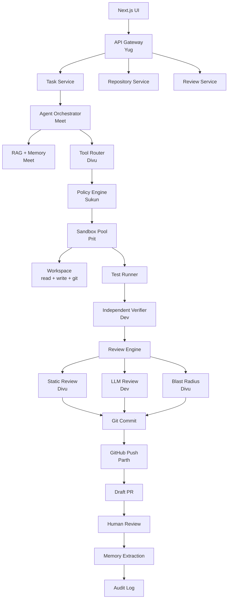

---

## Week 3 Hard Acceptance Criteria

### Agent

| Requirement | Test |
|-------------|------|
| Plan-and-Execute FSM works | FSM unit tests pass |
| ReAct execution loop | Agent completes a 3-step task |
| Pause / resume / cancel | Each tested manually |
| Checkpoint recovery | Agent recovers from simulated crash |
| Budget enforcement | Agent stops at token limit, saves checkpoint |
| Loop detection | Agent stops after 3 identical actions |

### GitHub

| Requirement | Test |
|-------------|------|
| Branch creation | `agent/task-XXX` branch exists after task start |
| Commit in workspace | Commit visible in workspace git log |
| Push to GitHub | Branch appears in GitHub UI |
| Draft PR created | PR visible in GitHub with correct metadata |
| Webhooks processed | push event triggers incremental sync |

### Sandbox

| Requirement | Limit |
|-------------|-------|
| CPU | 2 vCPU enforced |
| RAM | 4 GiB enforced |
| Disk | 10 GiB enforced |
| Process count | 512 max (fork bombs stopped) |
| Network egress | Denied except package registries |
| Credential isolation | Host env vars not visible |
| Cleanup on any exit | No orphan containers after task ends |

### Code Review

| Requirement | Test |
|-------------|------|
| Secret scanner | Detects `API_KEY = "..."` pattern |
| Linter | Runs project linter, reports violations |
| LLM review | Produces ≥ 1 finding on fixture with known defect |
| Findings have evidence | Each finding includes the relevant code snippet |
| Severity assigned | All findings have severity level |

### Performance

| Metric | Target |
|--------|--------|
| RAG retrieval (P95) | < 400ms |
| Sandbox provision (P95, with prewarm) | < 2s |
| Webhook acknowledgement | < 1s |
| Agent wall-clock limit | 30 minutes |

---

## 3-Week Project Milestone

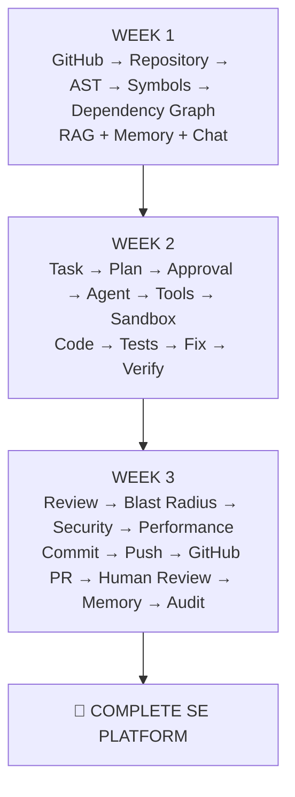

**The key rule for the whole three-week project:**

> Don't let Week 3 become another feature-development week. By Day 7 of Week 3, the priority is proving that the complete chain works **reliably, securely, and repeatably** — from a user's task description all the way to a reviewable GitHub PR with full traceability.
